# リモートセンシングとその解析
本教材は、「リモートセンシングとその解析」の実習用教材です。衛星画像をダウンロードし、ソフトウェアを用いて解析する手法について解説しています。衛星画像の解析には、無償で利用できるMultiSpecを用いています（解析後のデータ表示など、一部でQGISを利用しています）。講義用教材として、[地理情報科学教育用スライド（GIScスライド）]の2章が参考になります。  

本教材を使用する際は、[利用規約]をご確認いただき、これらの条件に同意された場合にのみご利用下さい。

[地理情報科学教育用スライド（GIScスライド）]:http://curricula.csis.u-tokyo.ac.jp/slide/2.html
[利用規約]:../../../master/利用規約.md

**Menu**
------
**データの入手**
- [データのダウンロード](#データのダウンロード)

**利用データの出典**  
本教材では、産総研LandBrowserをスクリーンショットとして利用しています。
"Image produced and distributed by AIST,  Source of Landsat 8 data: U.S. Geological Survey."

本教材では、産総研LandBrowserからダウンローしたLandsat8のデータを使用しています。
"The source data were downloaded from AIST's LandBrowser,
 (http://landbrowser.geogrid.org/landbrowser/index.html/). Landsat 8 data courtesy of the U.S. Geological Survey."

**画像分類**
- [MultiSpecのインストール](#MultiSpecのインストール)
- [MultiSpecの起動](#MultiSpecの起動)
- [RGB合成](#RGB合成)
- [NDVI](#NDVI)
- [教師なし分類](#教師なし分類)
- [教師つき分類](#教師つき分類)

**使用データ**

LANDSAT-8（2014-12-09T17:19:28Z）  

**スライド教材**  
スライドのダウンロードは[こちら]
[こちら]:../../../../raw/master/GISオープン教材/06_リモートセンシングとその解析/リモートセンシングとその解析.pptx

----------
## データのダウンロード
産業総合研究所の[LandBrowser]から画像をダウンロードする。
[LandBrowser]:<http://landbrowser.geogrid.org/landbrowser/>
  
右上の「Display Menu」を確認する。

雲の量を調整する。
cloud:5～10（雲の量）程度に設定する。

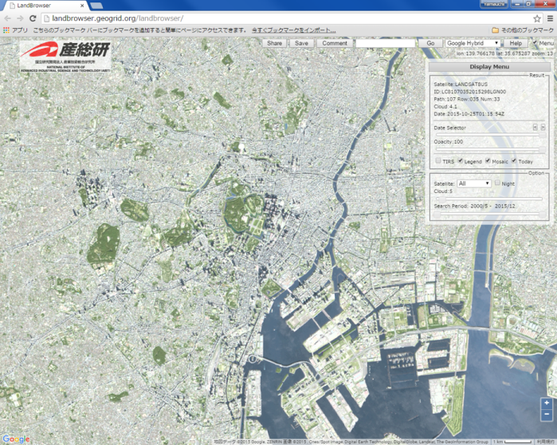  
ダウンロードする範囲を拡大する。

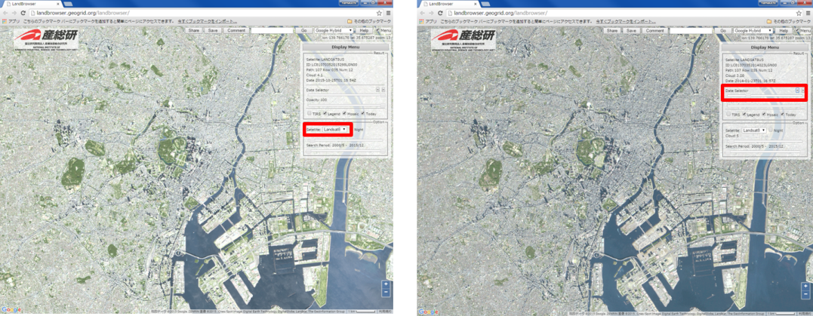
SatelliteからLandsat8を選択し、Date Selectorから画像を探す。

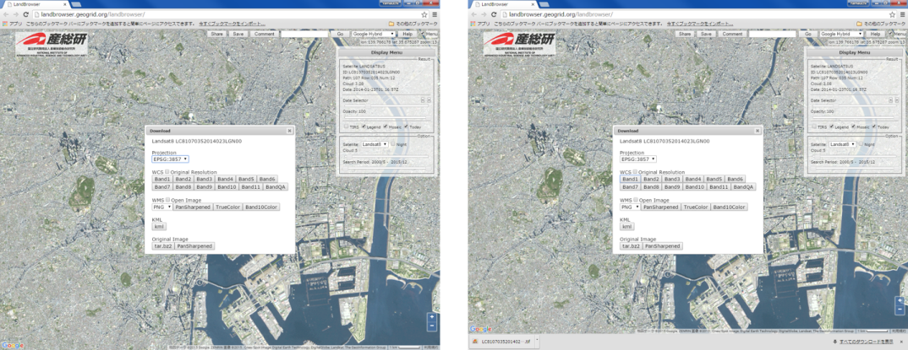
Saveをクリックし画像をダウンロードする。
今回は、WCSのBand1～Band11までをダウンロードする。  
[▲メニューへもどる]  
[▲メニューへもどる]:リモートセンシングとその解析.md#menu

## <a name = MultiSpecのインストール> MultiSpecのインストール
[MultiSpecの公式サイト]からMultiSpecをダウンロードする。
ダウンロード後にファイルを解凍する。
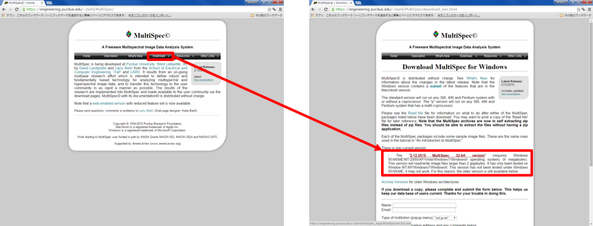

[▲メニューへもどる]  
[MultiSpecの公式サイト]:<https://engineering.purdue.edu/~biehl/MultiSpec/>
## <a name = MultiSpecの起動>MultiSpecの起動
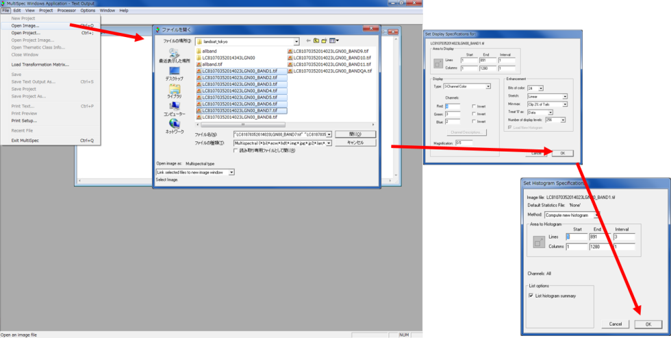
MultiSpecW32.exeをダブルクリックし、 MultiSpecを起動する。  
File>Open Imageから画像を読み込む。

[▲メニューへもどる]  

## <a name = RGB合成> RGB合成
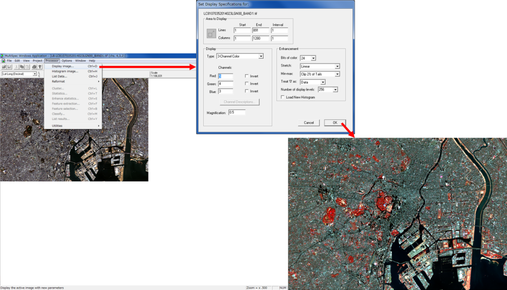
Processor>Display image…からR5,G4,B3を入力し、フォールスカラーを表示する。

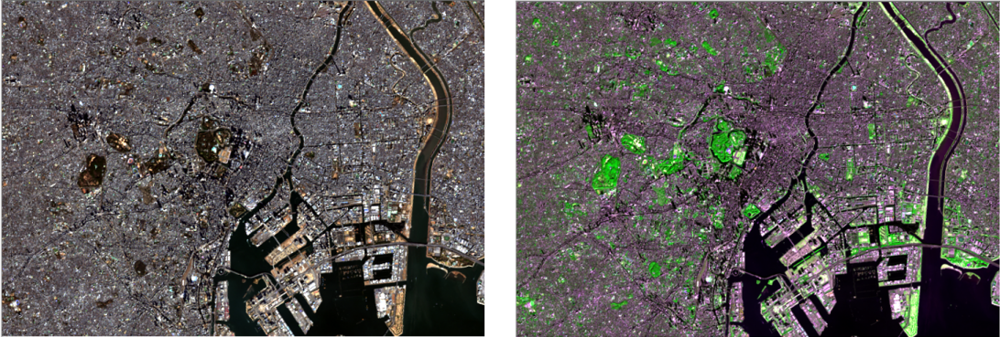
同じ方法で、左：トゥルースカラー(R4,G3,B2)と右：ナチュラルカラー(R4,G5,B3)を設定する。

[▲メニューへもどる]  

## <a name = NDVI>NDVI
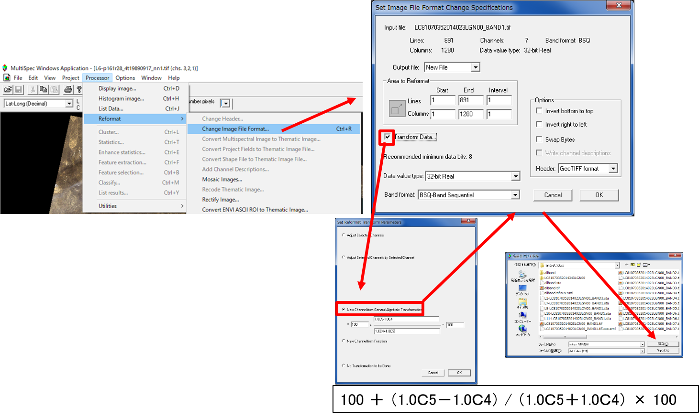
ProcesorからReformatを選択し、Open Image File Formatをクリックする。
Transform Data にチェックを入れ、New Channel from General algebraic Transformation をチェックする。
NDVIを求める式を入力し、OKをクリックし、保存する。  
※NDVI として計算される値は0 から200 の間の値になる。

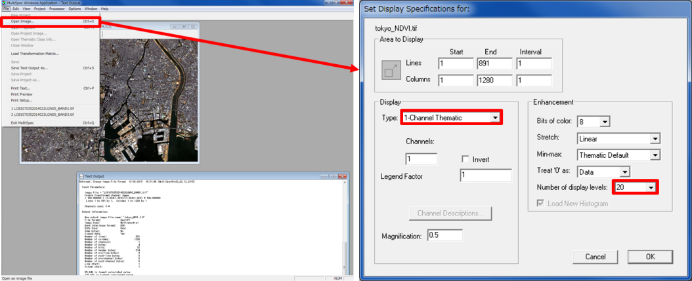
先ほど計算したファイルを開き、Typeを選択し、分類数を設定し、OKをクリックする。

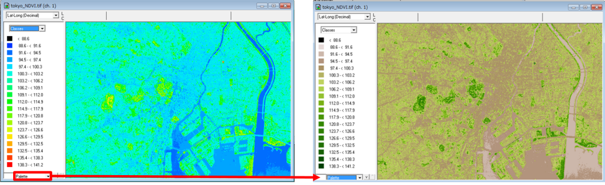
左下のカラーパレットより、ＭＯＤＩＳ ＮＤＶＩ をする。
ＮＤＶＩが表示できた。緑の濃い部分が植生活性度高い地域となる。

[▲メニューへもどる]  

## 教師なし分類
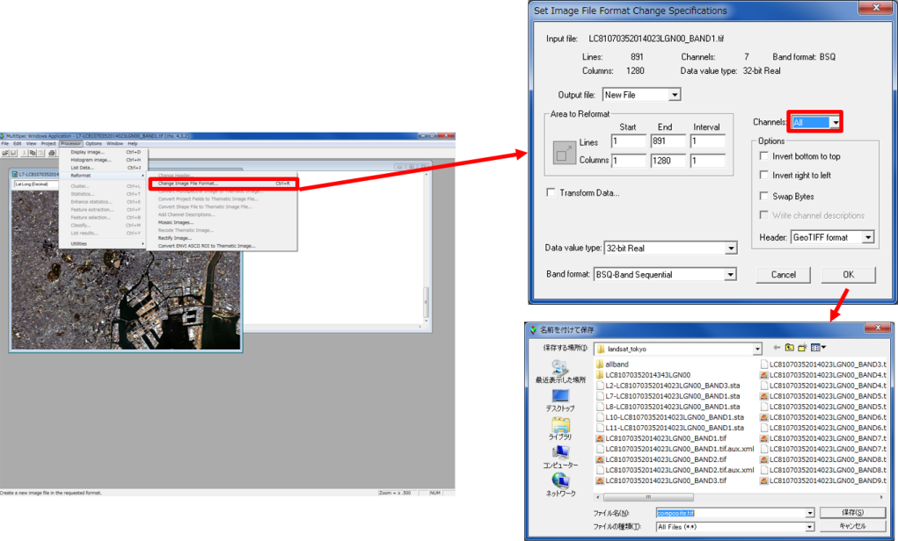
ProcessorからOpen Image File Formatを選択する。
ChannelsをAllにして、OKをクリックする（コンポジットバンドの作成）。

ProcessorからClusterを選択する。
ISODATAにチェックを入れ、分類数を10にして、OKをクリックする。
必要項目にチェックをいれ、OKをクリックすると分類が開始する。

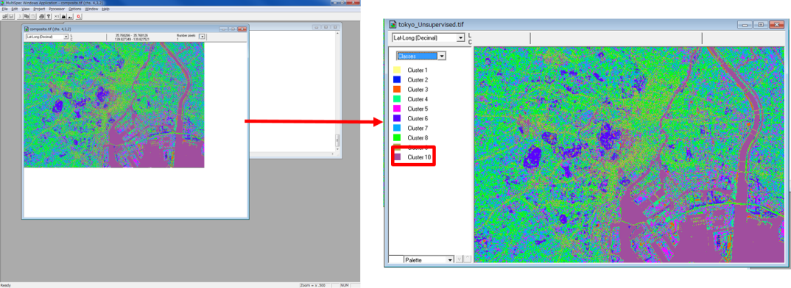
画像をFileから読み込みなおすと、右のように分類つきで表示される。
凡例の色をクリックすると、色が変更でき、名前をクリックすると名前が変更できる。

空中写真や現地調査をもとに土地利用の分類を行う。
（shiftキーをおしながら、凡例の色をクリックすると選択した色が消える）
今回は、水域、道路、森林、草地、裸地、人工構造物地域などに分類した。
色の指定ができたら、FileからSave image To GeoTIFF　Asをクリックする。

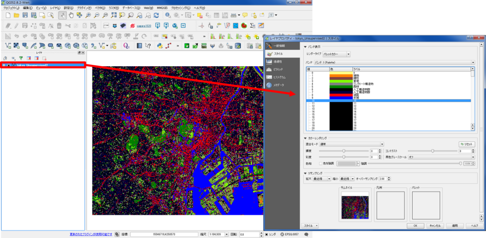
ＱＧＩＳを開き地図のレイアウトを行う。
画像を読み込み、レイヤのプロパティから凡例の設定を行う。

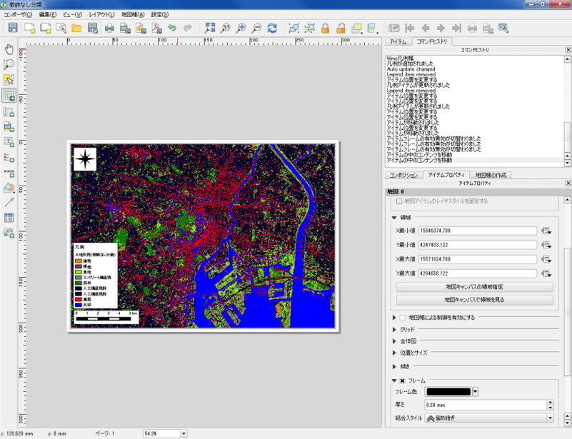  
ファイルから新規プリントコンポーザを開き、レイアウトを整える。
コンポーザー名は任意で入力する。

[▲メニューへもどる]  

## 教師つき分類
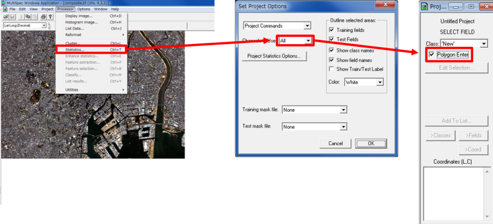
ProcessorからStatisticsを選択する。
Channels to UseをAllにして、OKをクリックする。
右端のようなウインドウが表示されるので、Polygon Enterにチェックを入れる。

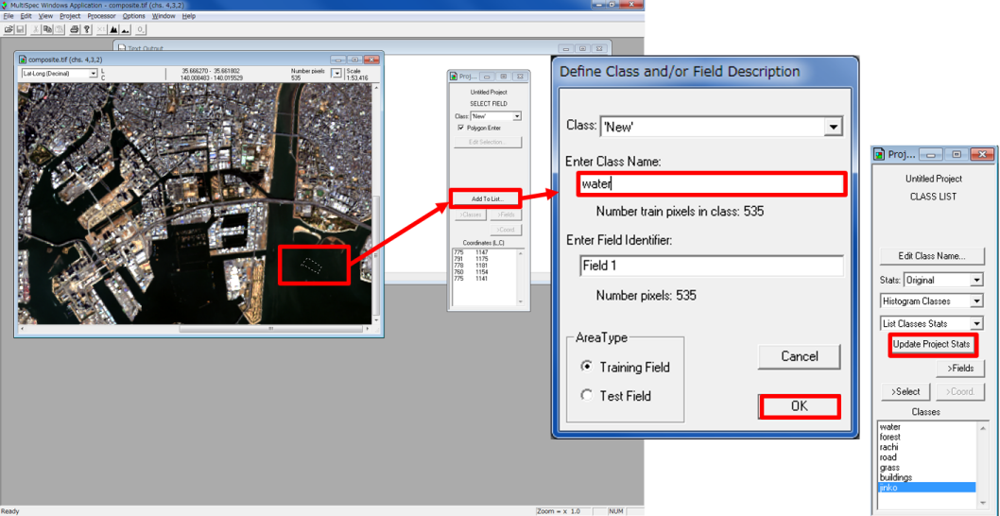
画像からトレーニングエリアを抽出する。
抽出ができたら、Add to Listをクリックし、Class名などを入力する。
同じ要領で複数のトレーニングエリアを作成後、Update Project Statsをクリックする。

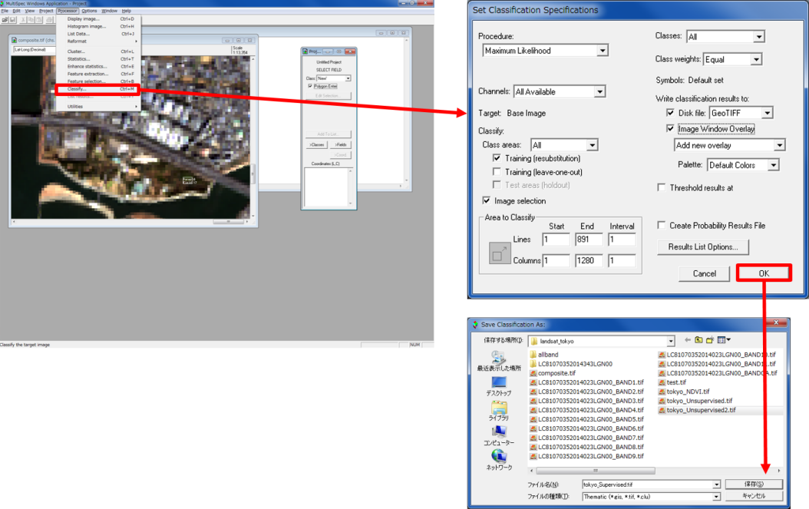
ProcessorからClassifyを選択し、最尤法（Maximum Likelihood）で分類を行う。
右上のように設定し、OKをクリックし、保存先を指定する。

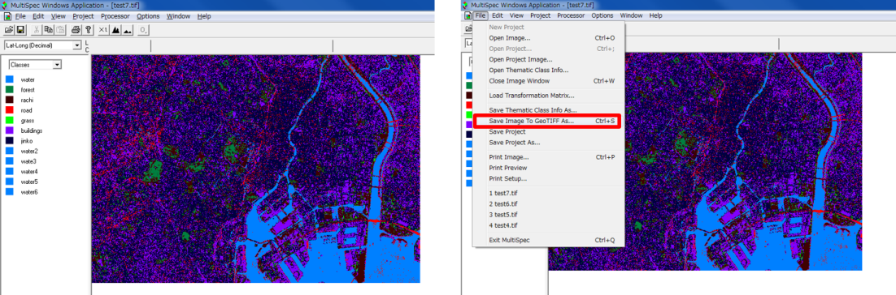
画像をFileから読み込みなおすと、右のように分類つきで表示される。
凡例の色をクリックすると、色が変更でき、名前をクリックすると名前が変更できる。
色の指定ができたら、FileからSave image To GeoTIFF　Asをクリックする。

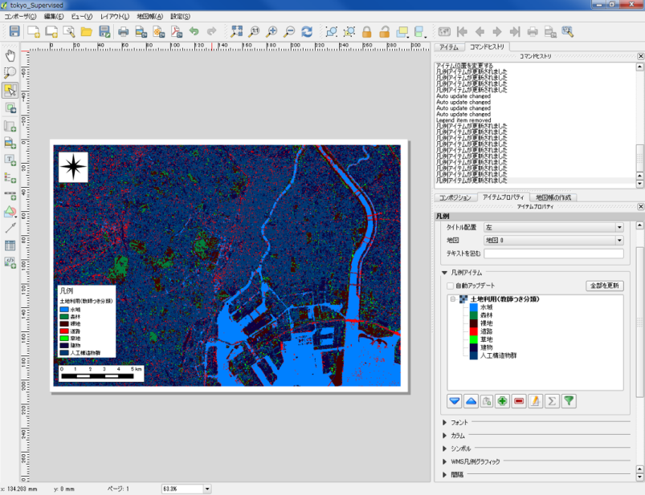  
ＱＧＩＳを開き、画像を読み込み、プロパティから凡例の設定を行う。
新規プリントコンポーザを開き、レイアウトを整える。

[▲メニューへもどる]  

**その他のライセンス**  
本教材で利用しているキャプチャ画像の出典やクレジットについては、[その他のライセンスについて]よりご確認ください。
[その他のライセンスについて]:../その他のライセンスについて.md
