# 空間データ
本教材は、「空間データ」の実習用教材です。GISソフトウェア（QGIS）を用いて、空間座標の変換、ジオリファレンス、ジオコーディングについて解説しています。
講義用教材として、[地理情報科学教育用スライド（GIScスライド）]の3章が参考になります。  

本教材を使用する際は、[利用規約]をご確認いただき、これらの条件に同意された場合にのみご利用下さい。

[地理情報科学教育用スライド（GIScスライド）]:http://curricula.csis.u-tokyo.ac.jp/slide/3.html
[利用規約]:../../../master/利用規約.md

**Menu**
-------
- [空間座標の変換(測地系変換、投影変換)](#空間座標の変換(測地系変換、投影変換))
- [ジオリファレンス](#ジオリファレンス)
- [ジオコーディング](#ジオコーディング)

**使用データ**
- 政府統計の総合窓口([e-Stat])甲府市行政区画日本測地系と世界測地系のshapeファイルを利用

[e-Stat]:http://www.e-stat.go.jp

- [鯖江市オープンデータ]　古地図007を利用（出典：越前鯖江５万石　ふるさと史跡紹介（2002年　鯖江地区まちづくり推進協議会　発行））
[鯖江市オープンデータ]:http://www.city.sabae.fukui.jp/pageview.html?id=12768
- [裾野市オープンデータ]　広域避難地・市指定避難所データ（出典:[広域避難地・市指定避難所]、裾野市、クリエイティブ・コモンズ・ライセンス 表示 2.1（http://creativecommons.org/licenses/by/2.1/jp/） ））を教材用に加工（緯度経度などを削除）し利用

[裾野市オープンデータ]:http://www.city.susono.shizuoka.jp/ma/organization/susono-open-data.php

- 国土地理院　[地理院タイル]

[地理院タイル]:http://maps.gsi.go.jp/development/ichiran.html

**スライド教材**  
スライドのダウンロードは[こちら]
[こちら]:../../../../raw/master/GISオープン教材/08_空間データ/空間データ.pptx
-------
## 空間座標の変換(測地系変換、投影変換)
### 測地系変換　（日本測地系から世界測地系）

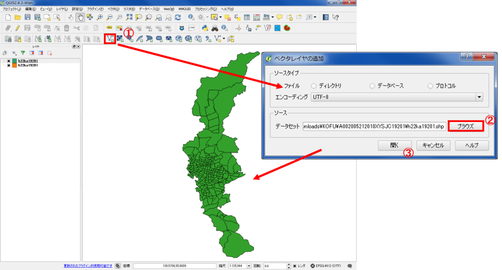
① ベクトル読み込みボタンをクリックし、ベクタレイヤを追加する。  
②「ブラウズ」から、ダウンロードした日本測地系と世界測地系のshapeを読み込む。  
③「開く」 をクリック。  

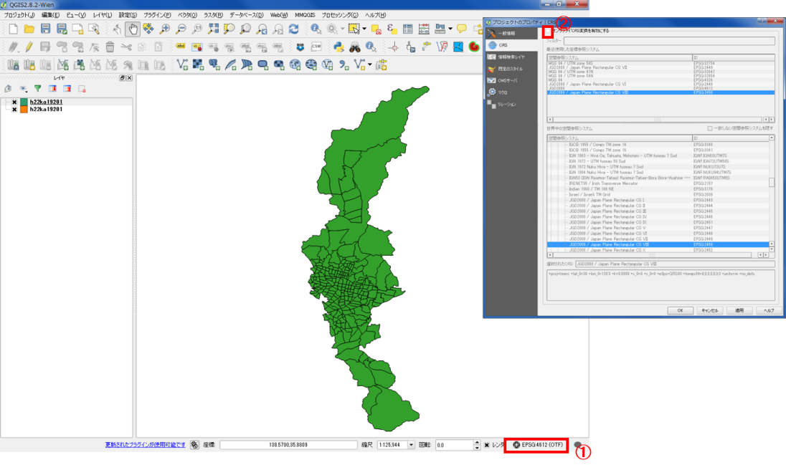
① 右下のEPSGのボタンをクリック  
② チェックをはずし、オンザフライ投影を無効にする。  
※QGISが自動で、擬似的な位置あわせをしてしまうため。  

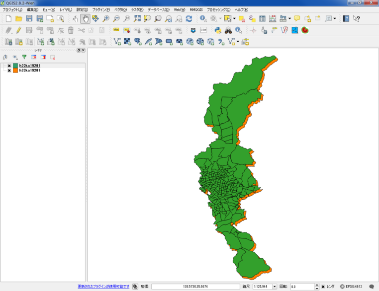  
先ほどまで同じ位置に表示されていたデータが、測地系が異なるためずれて表示される。

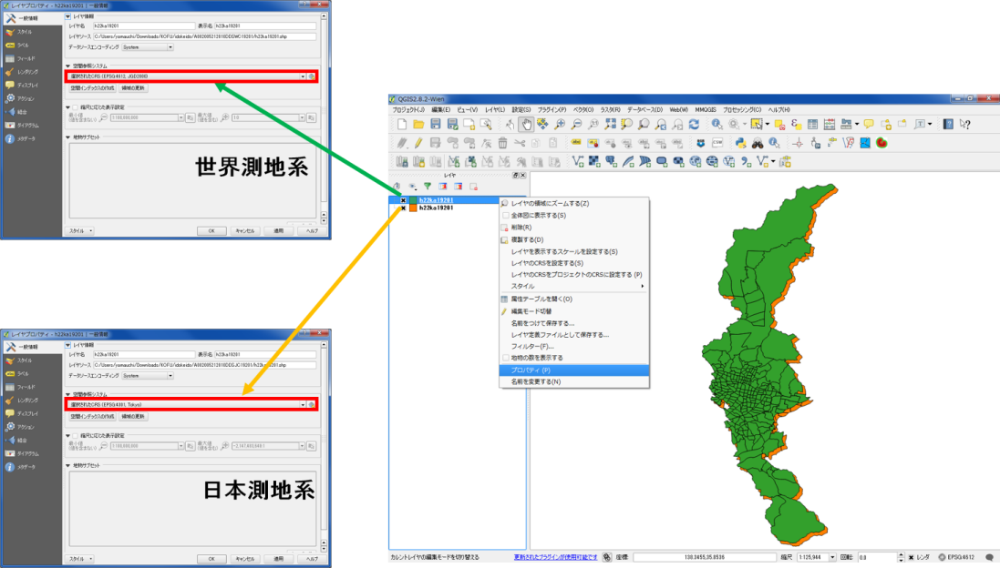
それぞれのレイヤの上で右クリックして、プロパティ（一般情報のタブ）から座標系を確認する。

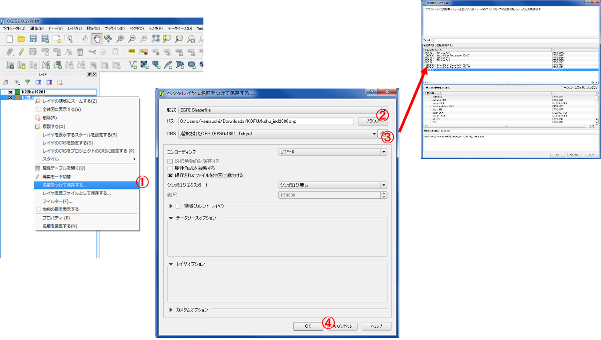
① プロパティから「名前をつけて保存する」をクリックする 。  
② 新規レイヤの出力先と名前を選択する。    
③ CRSのボタンをクリックし、変更したいCRSを選択（今回はJGD2000）してOKをクリックする。  
④ OKをクリックする。  

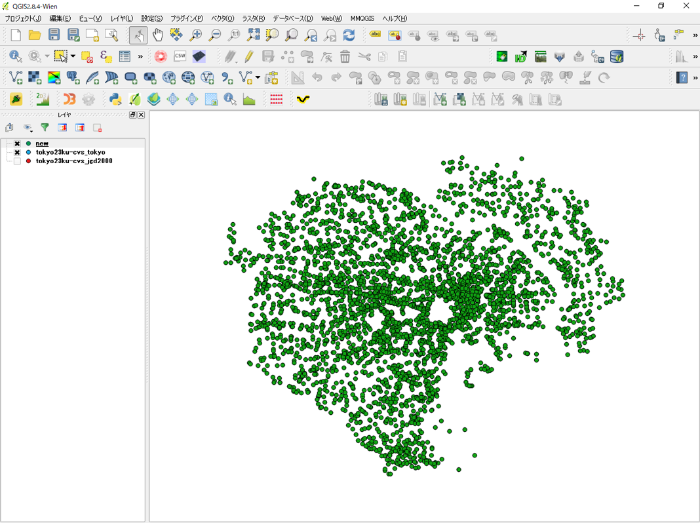
測地系がJGD2000に変換された。

### 投影変換（地理座標系から投影座標系）
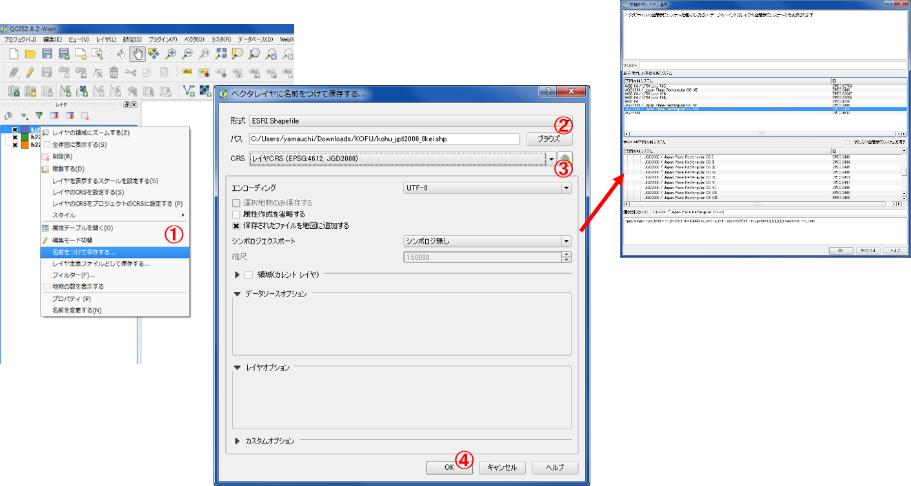
① プロパティから「名前をつけて保存」をクリックする。  
② 新規レイヤの出力先と名前を選択する。  
③ CRSのボタンをクリックし、変更したいCRSを選択（JGD2000 / Japan Plane Rectangular CS Ⅷ）してOKをクリックする。  
④ OKをクリックする。  

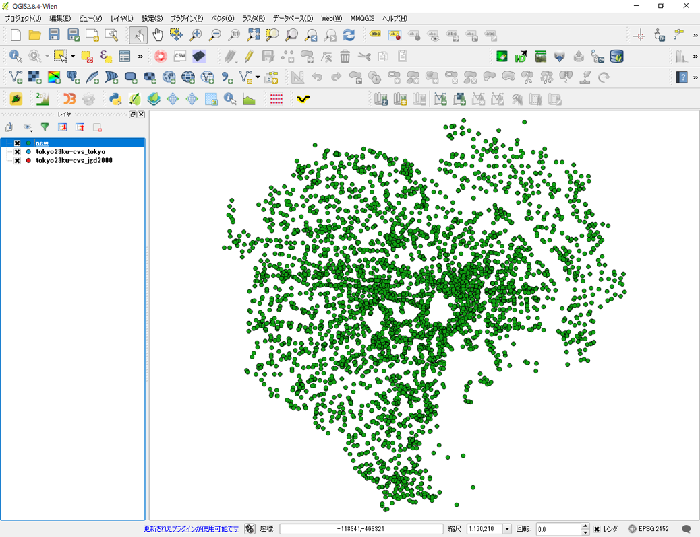
測地系が（JGD2000 / Japan Plane Rectangular CS Ⅷ）に変換された。

[▲メニューへもどる]    
[▲メニューへもどる]:空間データ.md#menu
## ジオリファレンス
鯖江市のオープンデータより古地図007をダウンロードし、QGISのジオリファレンサーで読み込む。
地理院タイルをもとにGCPを取得し、位置あわせを行う（位置合わせ用のshpファイルを読み込んでおくと良い）。

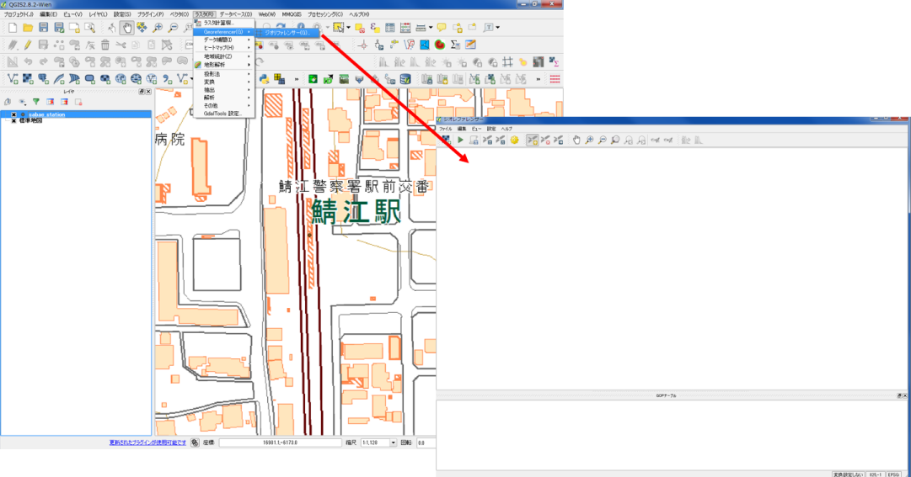  
ＱＧＩＳで位置合わせ用のshapeファイルと地理院タイルを読み込む。
ラスタからジオリファレンサーを開く。

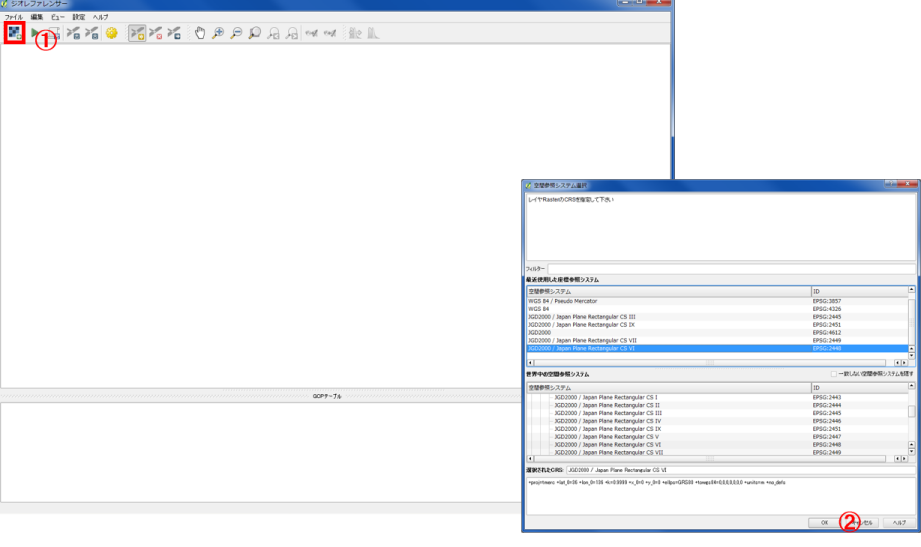  
ジオリファレンサーで位置合わせしたいラスタを読み込む。  
① ラスタの読み込みボタンをクリックし、ラスタを選択する。  
② 座標系を選択し、OKをクリックする。  

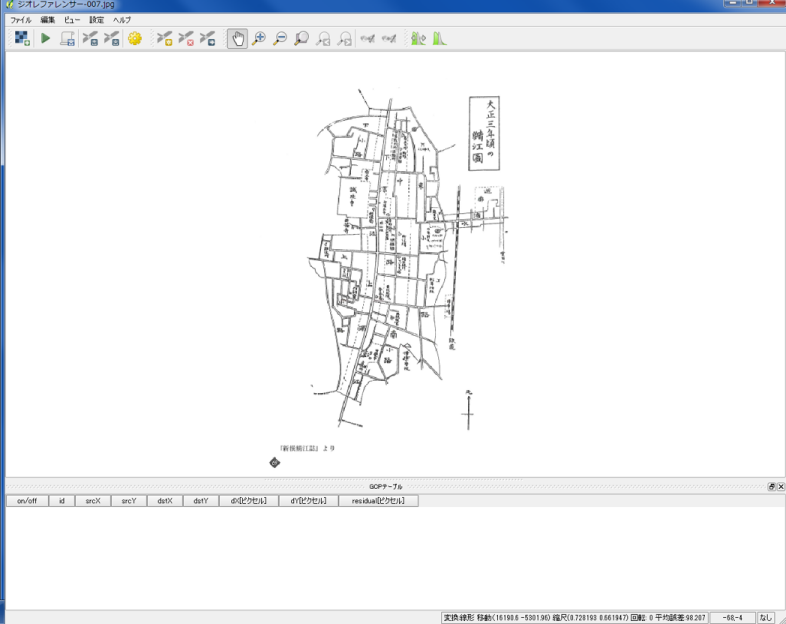  
ジオリファレンサーにラスタが入力された。

### GCPの作成

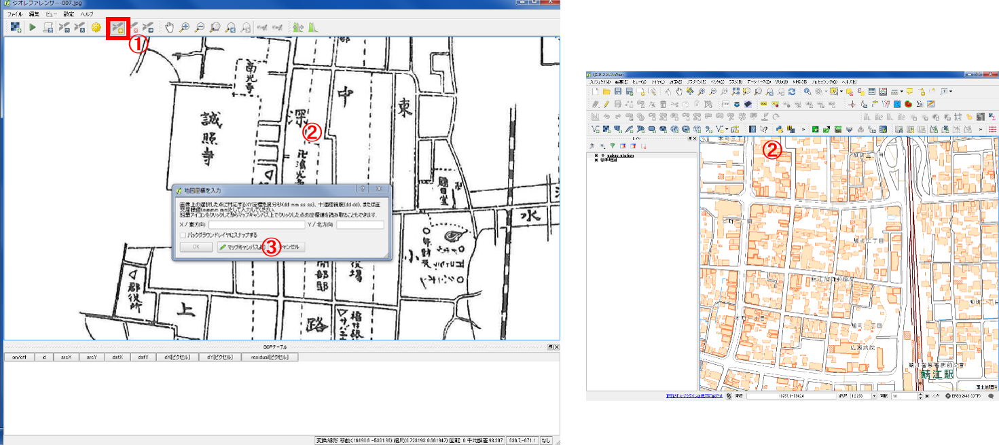  
① GCPを追加するボタンをクリックする。  
② ジオリファレンサーで入力したラスタの代表点をクリックする。  
③「マップキャンバスより」　をクリックする。  
　※座標がわかってる場合は座標値を入力する。  
④ QGISに入力した地理院タイルをベースに、ジオリファレンサーのラスタと同じ位置の代表点をクリックする。

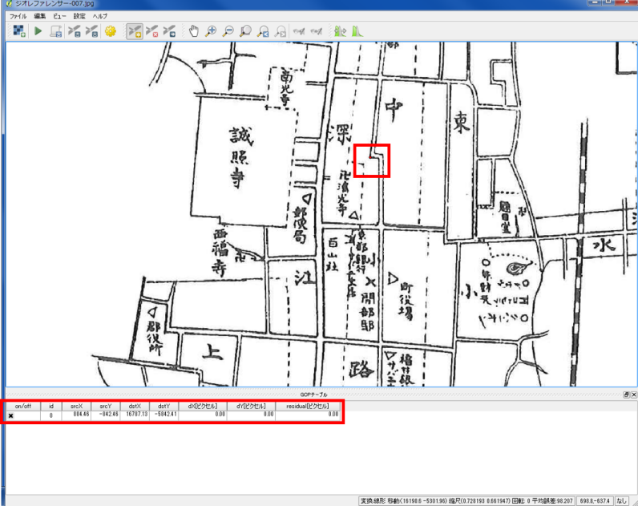  
ジオリファレンサーで表示されたラスタの上に座標値をもった点が表示され、GCPテーブルに詳細が表示される。

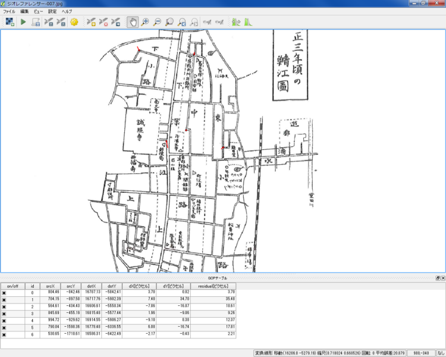  
GCPの位置に偏りがでないように、同じ作業を行いGCPを増やしていく。

GCPの取得ができたら、位置情報をもったラスタを出力する。
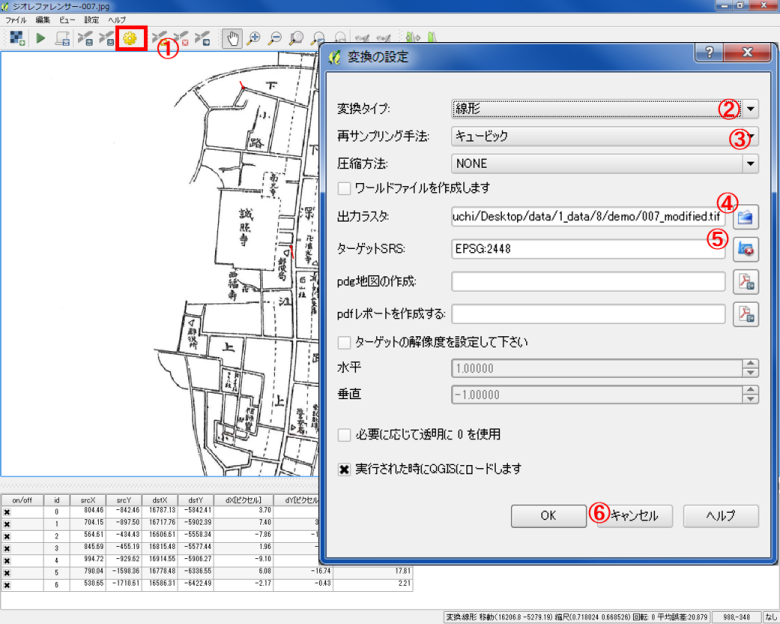  
① 変換の設定をクリックする。  
② 線形を選択する。  
③ キュービックを選択する。  
④ 新規レイヤの出力先と名前を入力する。  
⑤ SRSを選択する。  
⑥ OKをクリックする。  

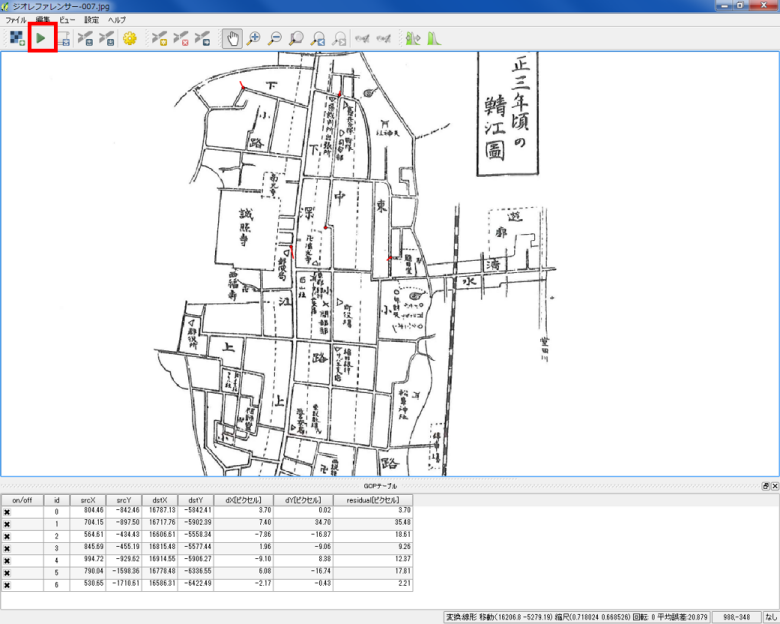  
右向き三角のボタンをクリックすると、QGISにラスタが表示される。

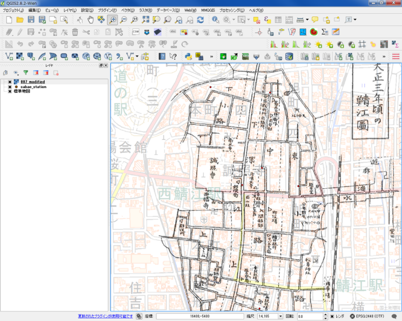  
ラスタに位置情報を付加することができた。

[▲メニューへもどる]   

## ジオコーディング
### Google Maps Geocoding APIを利用する
Google Maps Geocoding APIを利用したサイトにアクセスし、裾野市広域避難地・指定避難所の住所を用いてマッピングを行う。  

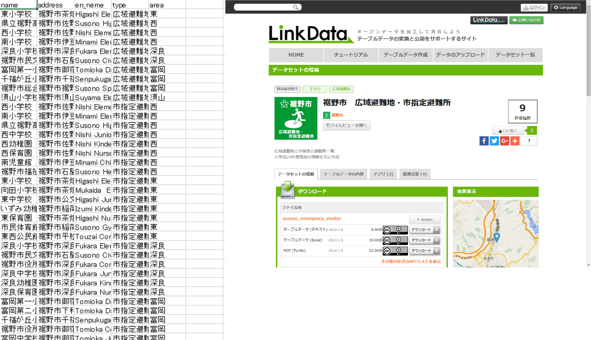  
http://linkdata.org/work/rdf1s1009i
 よりデータをダウンロードし、裾野市広域避難地・市指定避難所の住所一覧を.csv形式（カンマ区切り）で作成する。

[Google Maps Geocoding API]を利用した、位置情報取得サイトはいくつかある。
今回は、埼玉大学の谷謙二先生が提供している[KTGIS.net]のジオコーディングサービスを利用する。

[Google Maps Geocoding API]:https://developers.google.com/maps/documentation/geocoding/intro?hl=ja
[KTGIS.net]:http://ktgis.net/gcode/geocoding.html

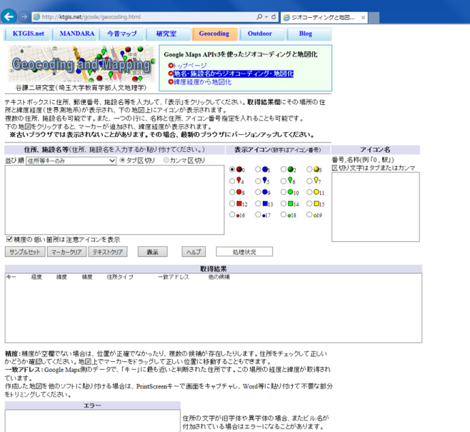  
[KTGIS.net]にアクセスし、上のタブからGeocodingをクリックする。

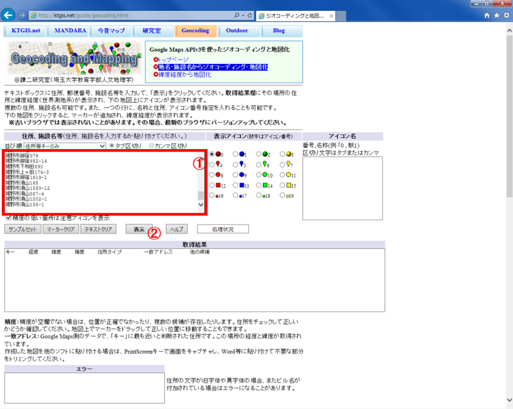  
① 避難所をまとめたCSVから、コピーした住所を張り付ける。  
② 表示をクリックする。  

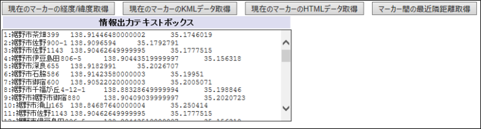  
サイトの下段にある地図の上ポイントが表示される。
情報出力テキストボックスから、マーカーの緯度経度、kmlデータ、最近隣距離などが出力できる。

### CSVアドレスマッチングサービスを利用する
東京大学空間情報科学研究センターが提供する[CSVアドレスマッチングサービス]を利用して、住所から緯度経度を求める。

[CSVアドレスマッチングサービス]:http://newspat.csis.u-tokyo.ac.jp/geocode-cgi/geocode.cgi?action=start

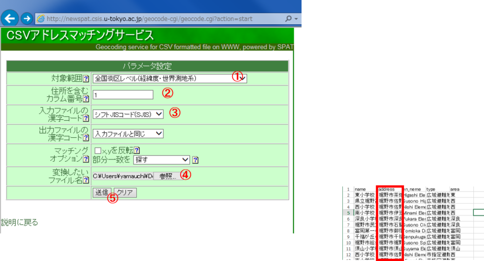  
① 全国街区レベル（緯経度・世界測地系）を選択する。  
② 住所を含むカラムに 2 を入力（エクセルでみたときの住所が入っている箇所に相当する）する。  
③ シフトJISコード（SJIS）を選択する。  
④ 避難所をまとめたCSVを選択する。  
⑤ 送信をクリックする。  
  その後、保存のウインドウが表示される。  

#### QGISで緯度経度つきのCSVデータを表示する
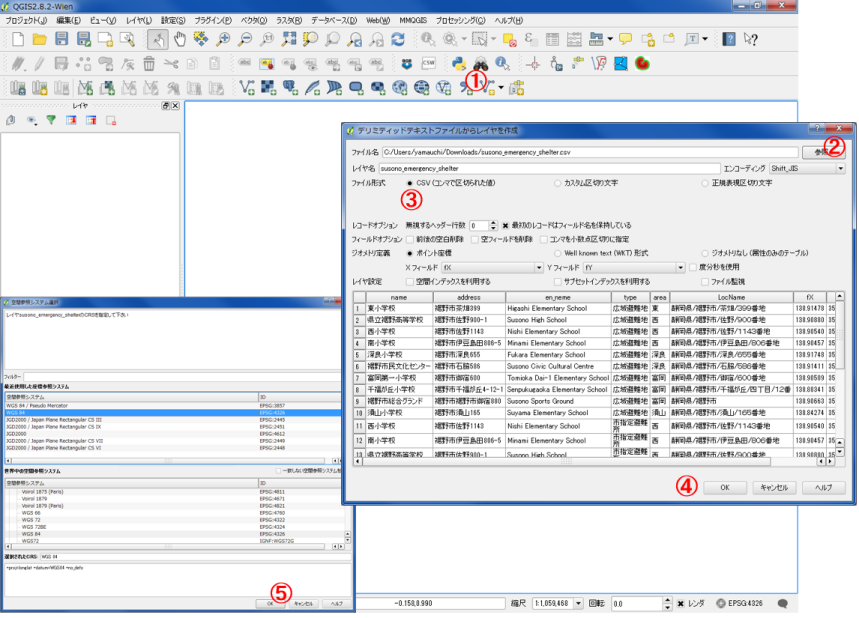  
① テキストファイル読み込みボタンをクリックする。  
② ダウンロードしたデータを選択する。  
③ CSVにチェックを入れる。  
④ OKをクリック  
⑤ WGS84を選択しOKをクリック

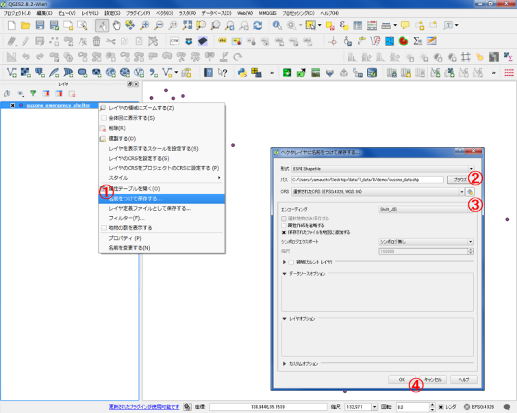  
①　プロパティから名前をつけて保存をクリックする。  
② 新規レイヤの出力先と名前を選択する。  
③ CRSのボタンをクリックし、変更したいCRSを選択WGS84にしてOKをクリックする。  
④ OKをクリックする。  

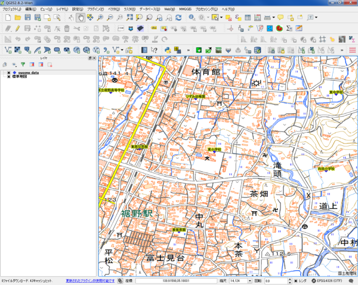  
裾野市の広域避難地・市指定避難所データを地図に表示
。

[▲メニューへもどる]   

**その他のライセンス**  
本教材で利用しているキャプチャ画像の出典やクレジットについては、[その他のライセンスについて]よりご確認ください。
[その他のライセンスについて]:../その他のライセンスについて.md
