# 基本的な空間解析
本教材は、「基本的な空間解析」の実習用教材です。GISソフトウェア（QGIS）を用いた、地物の計測、ディゾルブ、クリップなどの空間解析手法について解説しています。講義用教材として、[地理情報科学教育用スライド（GIScスライド）]の4章が参考になります。  

本教材を使用する際は、[利用規約]をご確認いただき、これらの条件に同意された場合にのみご利用下さい。

[地理情報科学教育用スライド（GIScスライド）]:http://curricula.csis.u-tokyo.ac.jp/slide/4.html
[利用規約]:../../../master/利用規約.md

**Menu**
------
* [基本量の測定と空間オブジェクトの選択](#基本量の測定と空間オブジェクトの選択)
* [その他の空間データの操作](#その他の空間データの操作)
* [オーバーレイ分析](#オーバーレイ分析)

**使用データ**
* 「国土交通省国土政策局「国土数値情報（奈良県　行政区域、学校、河川データ）」を加工（座標変換[EPSG:2448] ）し利用
* 政府統計の総合窓口([e-Stat]) 奈良市、大和郡山市境界データを利用
* 国土地理院　[地理院タイル]

[国土数値情報]:http://nlftp.mlit.go.jp/ksj/
[e-Stat]:http://www.e-stat.go.jp/
[地理院タイル]:http://maps.gsi.go.jp/development/ichiran.html

**スライド教材**  
スライドのダウンロードは[こちら]
[こちら]:../../../../raw/master/GISオープン教材/11_基本的な空間解析/基本的な空間解析.pptx
--------

## 基本量の測定と空間オブジェクトの選択
地理院タイルを用いて、猿沢池の周長と面積の測定を行う。
奈良市の境界データを読み込み、タイルレイヤプラグインから地理院タイルの標準地図を読み込む。タイルレイヤプラグインについては、[QGISビギナーズマニュアル]を参照。

[QGISビギナーズマニュアル]:

### 手動で、長さ と 面積 を計測する
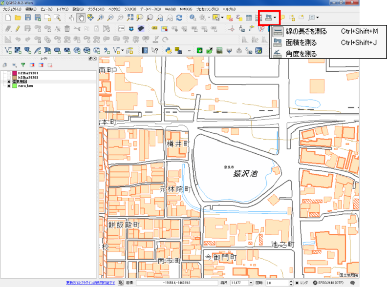  
計測ツールをクリックし、線の長さを測るを選択する。

#### 猿沢池の周長を測定
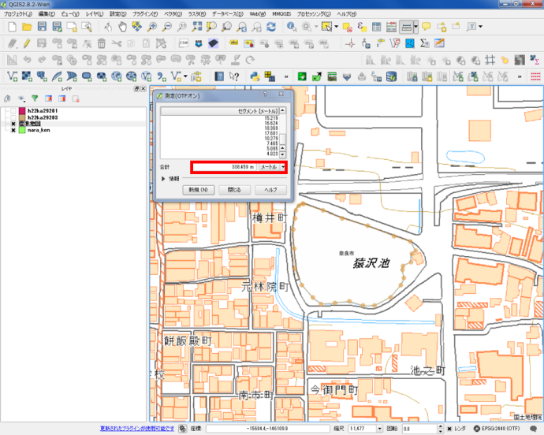  
池の外周を縁取るように、点を打ち、最初の点と重なったところで右クリックする。  
線の長さが計測できるが、計測結果に個人差がある。  
※　手動　－　周長：338.459m

#### 猿沢池の面積を測定
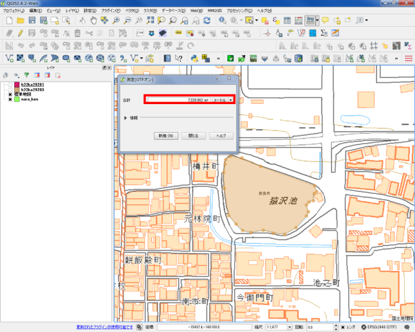  
池の外周を縁取るように、点を打ち、最初の点と重なったところで右クリックする。  
線の長さが計測できるが、計測結果に個人差がある。   
※　手動　－　面積： 7,320.962 ㎡

### フィールド演算から、長さ と 面積 を計測する
奈良県の行政区域データから市町村の境界の長さと面積を計算する。
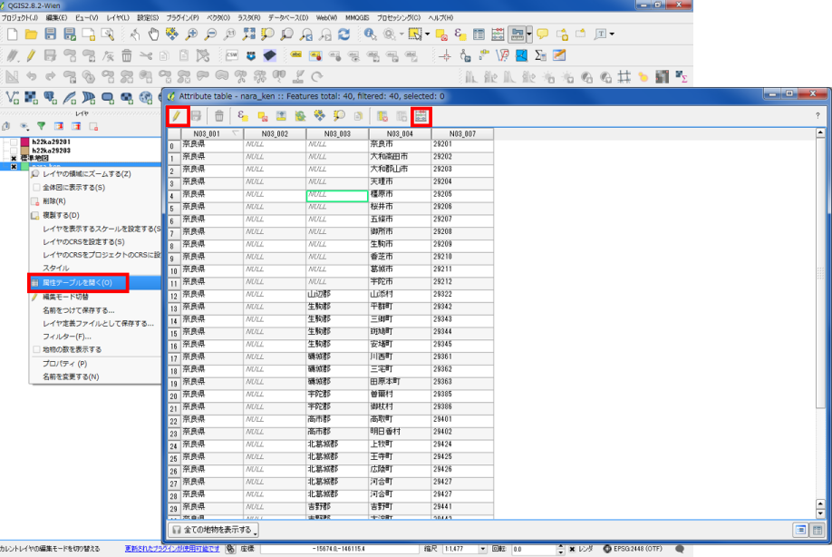  
① 属性テーブルを開き、編集モードに切り替える。  
② フィールド計算機を開く。

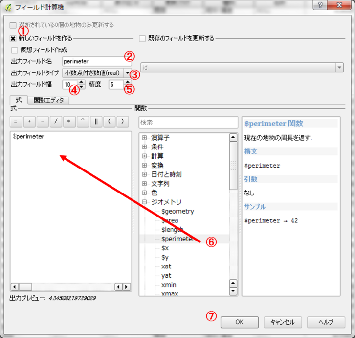  
① 「新しいフィールドを作る」にチェックする。  
② フィールド名：　perimeter  
③ 出力フィールドタイプ：　real  
④ 出力フィールド幅：　10 ※任意で変更可  
⑤ 精度：　5 ※任意で変更可  
⑥ 関数：　ジオメトリから$perimeterをダブルクリックする。※式に$perimeterが表示される。  
※今回は周長なので$perimeterを選択する。  
線長を計測する場合には、$lengthを使用する。  
⑦ OKをクリックする。  
※面積の計測には、同じ手順で、$areaを使用する。

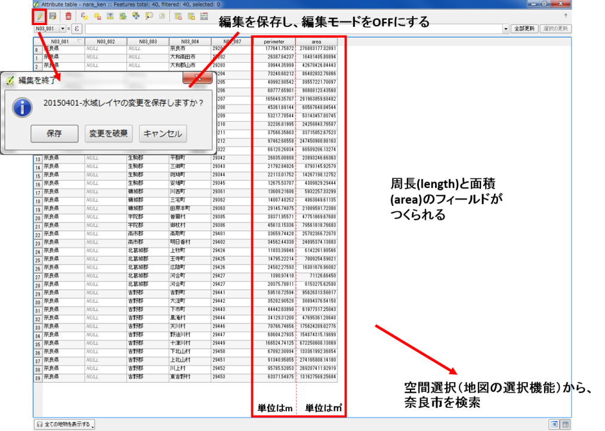  
周長(length)と面積(area)のフィールドがつくられる。
空間選択（地図の選択機能）から、奈良市を検索する。

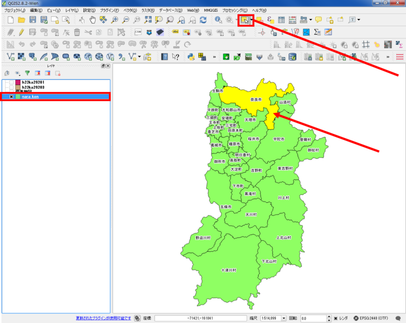  
属性テーブルから選択しない場合は、選択ボタンを利用する。  
奈良市をクリックし、青色になっているのを確認したのち、地物選択をクリックする。
奈良市をクリックすると、色が黄色（選択色）になる。

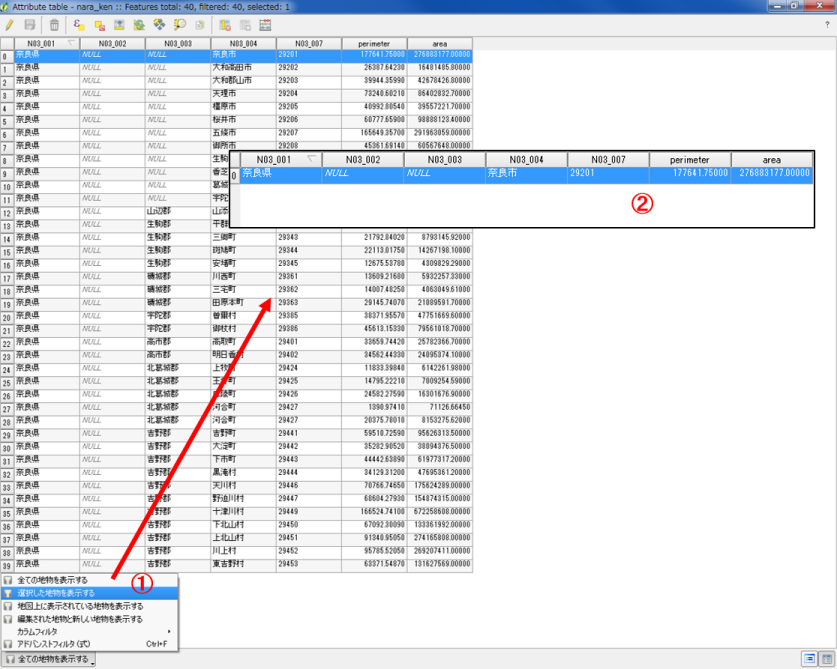  
① 属性テーブルを開き選択した地物を表示する。  
② 地図で選択した地物のみ表示される。  

[▲メニューへもどる]  
[▲メニューへもどる]:基本的な空間解析.md#menu

## その他の空間データの操作
奈良市と大和郡山市にある学校を抽出する。  
あらかじめ、複数のデータを一つのフォルダー（新規にフォルダーを作成し）へ移動しておく。  
※shapeファイルは複数のデータで一つのファイルであるため、移動の際はすべてを動かすようにする。

### 奈良市と大和郡山市のポリゴンをマージ(Merge)する
ベクタ＞データマネージメントツール＞複数のシェープファイルを一つに結合する
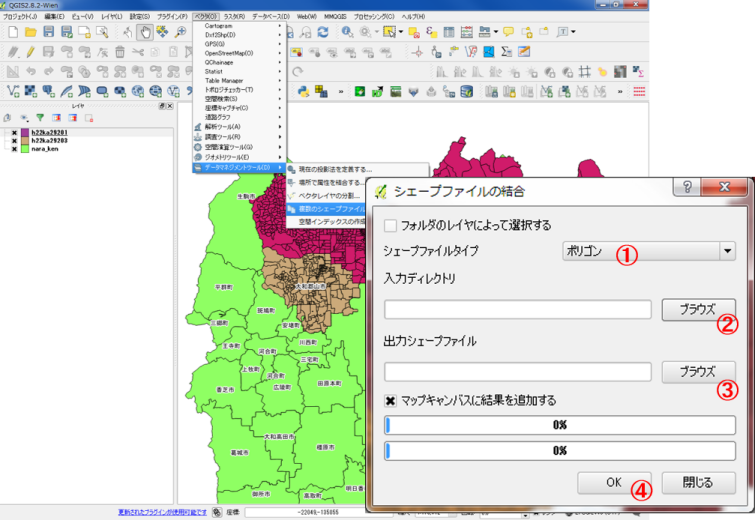  
① ポリゴンを選択する。  
② ブラウズから入力ディレクトリを選択する。  
③ ブラウズから出力するシェープファイルの保存する場所と名前を入力する。  
④ OKをクリックする。  

奈良市と大和郡山市がマージされ、一つのポリゴンになった。
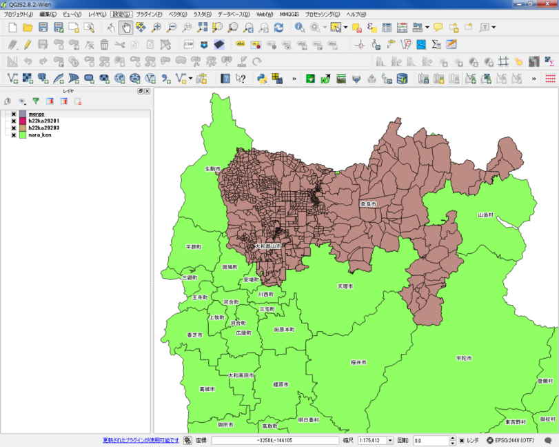  

### マージしたポリゴンをデイゾルブ(Dissolve)する
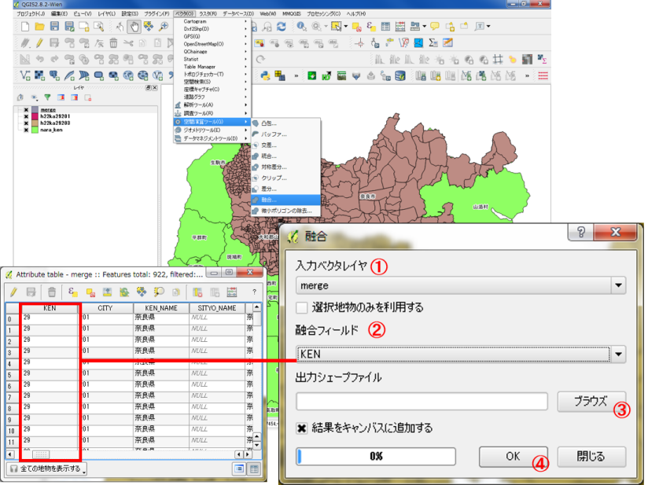  
ベクタ＞空間演算ツール＞融合
① 入力ベクタレイヤを選択する。  
② 融合フィールドを指定する。  
融合フィールドは、属性が統一されている行を選択する。  
③ ブラウズから、出力場所と名前を入力する。  
④ OKを入力する。  

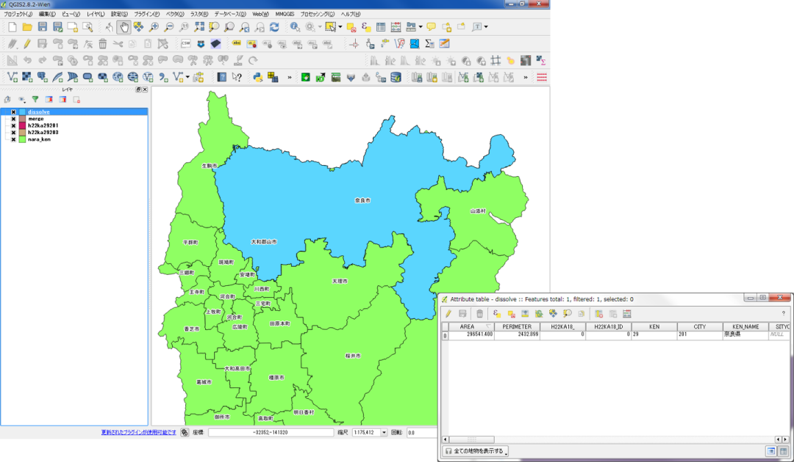  
町丁目界がなくなり、単純なポリゴンが作成できた。

### ディゾルブしたポリゴンをもとに学校をクリップ(Clip)する。
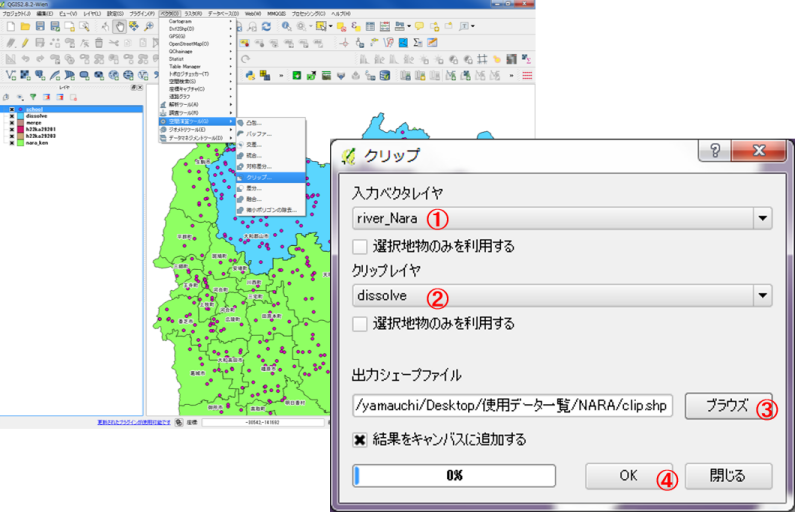  
ベクタ＞空間演算ツール＞クリップ  
① 入力ベクタレイヤに学校レイヤを追加する。  
② クリップレイヤにデイゾルブした市域のレイヤを追加する。  
③ ブラウズから、出力場所と名前を入力する。  
④ OKを入力する。  
※入力レイヤ：　切り取りたいレイヤ  
　クリップレイヤ：　クリップに使うレイヤ

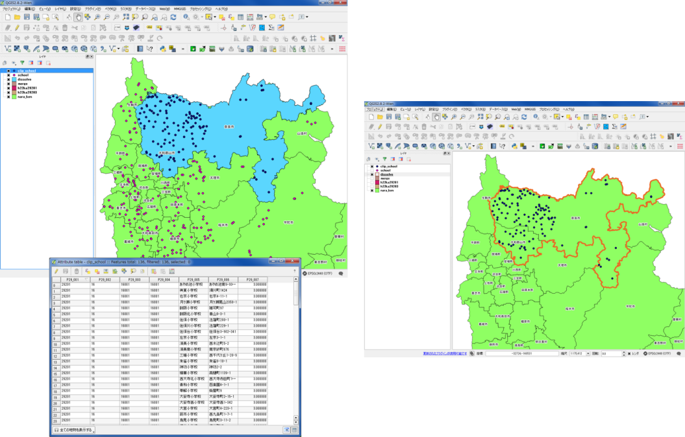  
奈良市と大和郡山市にある学校が抽出できた。

[▲メニューへもどる]

## オーバーレイ分析

### インターセクト(Intersect)
国土数値情報の河川レイヤを用いて、大和郡山市と交わる水域を、インターセクトし(Intersect)、別のポリゴンにする。  

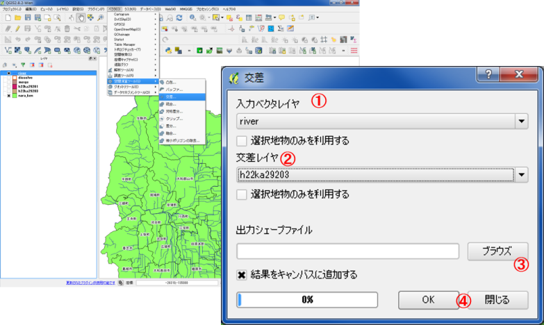  
ベクター＞空間演算ツール＞交差
① 入力ベクタレイヤを水域にする。　　
② 交差レイヤを大和郡山市にする。　　
③ ブラウズから、出力場所と名前を入力する。　　
④ OKを入力する。　

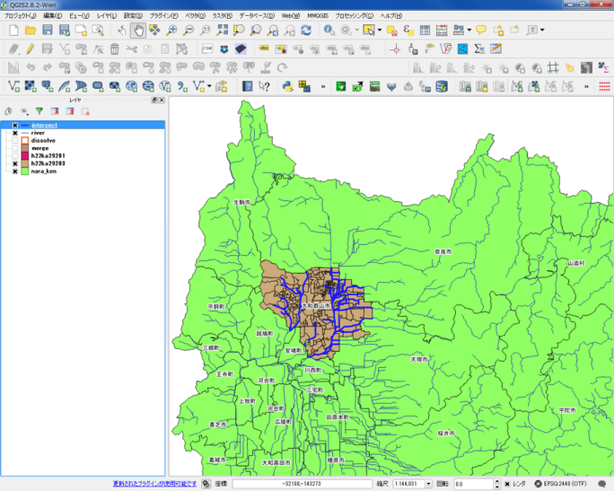  
大和郡山市と交差するレイヤが新規に作成された。
※属性情報をチェックしクリップとの違いを確認する。ポリゴンやラインは、長さや面積の再計算が必要な場合がある。

### ユニオン (Union)
奈良県と奈良市町丁目のポリゴンを一つのポリゴンに統合する。

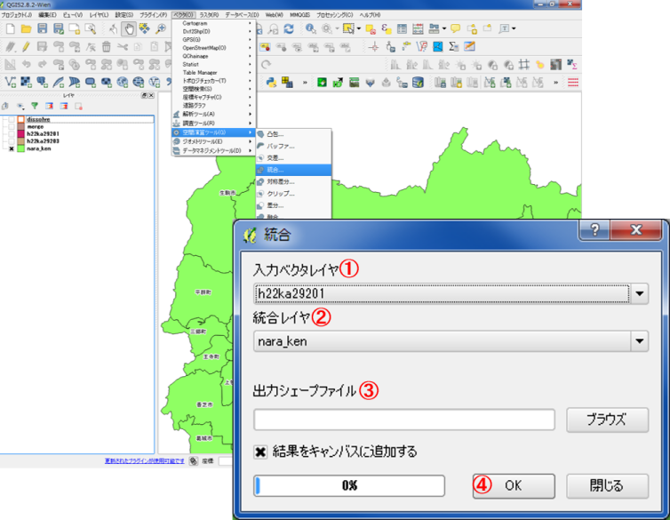  
ベクター＞空間演算ツール＞統合
① 入力ベクタレイヤを奈良市にする。  
② 交差レイヤを奈良県にする。  
③ ブラウズから、出力場所と名前を入力する。  
④ OKを入力する。  

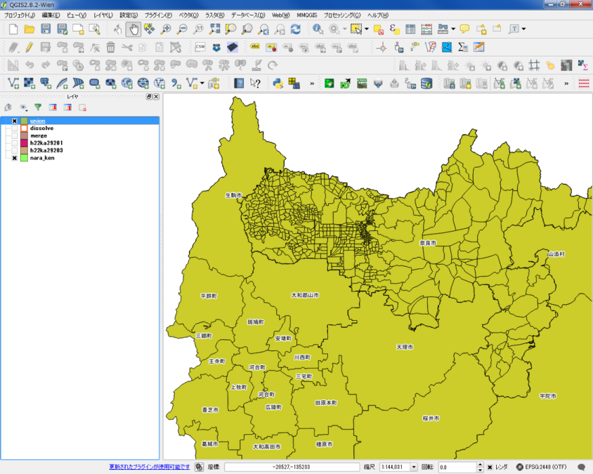  
奈良県と奈良市町丁目のポリゴンを一つのポリゴンに統合できた。

[▲メニューへもどる]

**その他のライセンス**  
本教材で利用しているキャプチャ画像の出典やクレジットについては、[その他のライセンスについて]よりご確認ください。
[その他のライセンスについて]:../その他のライセンスについて.md
