# 領域分析
本教材は、「領域分析」の実習用教材です。GISソフトウェア（QGIS）を用いた、バッファなどの領域分析の手法について解説しています。  
講義用教材として、[地理情報科学教育用スライド（GIScスライド）]の4章が参考になります。  

本教材を使用する際は、[利用規約]をご確認いただき、これらの条件に同意された場合にのみご利用下さい。

[地理情報科学教育用スライド（GIScスライド）]:http://curricula.csis.u-tokyo.ac.jp/slide/4.html
[利用規約]:../../../master/利用規約.md
**Menu**
------
* [バッファによる領域分析](#バッファによる領域分析)
* [ボロノイ分割による領域分析](#ボロノイ分割による領域分析)
* [ドローネ三角形](#ドローネ三角形)

**使用データ**

* 「国土交通省国土政策局「[国土数値情報]（愛知県　行政区域、郵便局、小学校、小学校区データ　全国　鉄道線、鉄道駅、空港データ）」を加工し、利用」

[国土数値情報]:http://nlftp.mlit.go.jp/ksj/index.html

**スライド教材**  
スライドのダウンロードは[こちら](https://github.com/yamauchi-inochu/demo/raw/master/GIS%E3%82%AA%E3%83%BC%E3%83%97%E3%83%B3%E6%95%99%E6%9D%90/13_%E9%A0%98%E5%9F%9F%E5%88%86%E6%9E%90/%E9%A0%98%E5%9F%9F%E5%88%86%E6%9E%90.pptx)
-------
## バッファによる領域分析
国土数値情報よりダウンロードしたポイントデータを利用し、バッファの処理を行う。  
空間検索による地物の検索も行う。

### 点バッファの作成
駅のポイントから500mのバッファを表示し、空間検索でバッファと重なる郵便局を抽出する。  
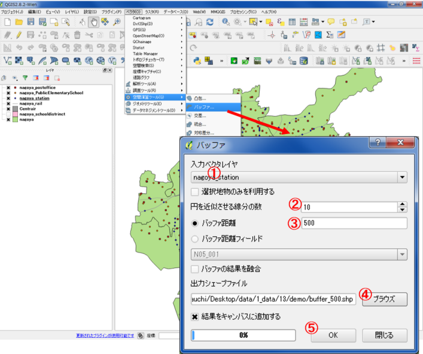  
ベクタ＞空間演算ツール＞バッファ  
① 駅を選択する。  
② 円を近似させる線分の数10を入力する。（数が多いほどきれいな円になる）  
③ 平面直角座標系であることを確認したのちに500を入力する。  
④ 出力先と名称を指定する。  
⑤ OKをクリックする。  

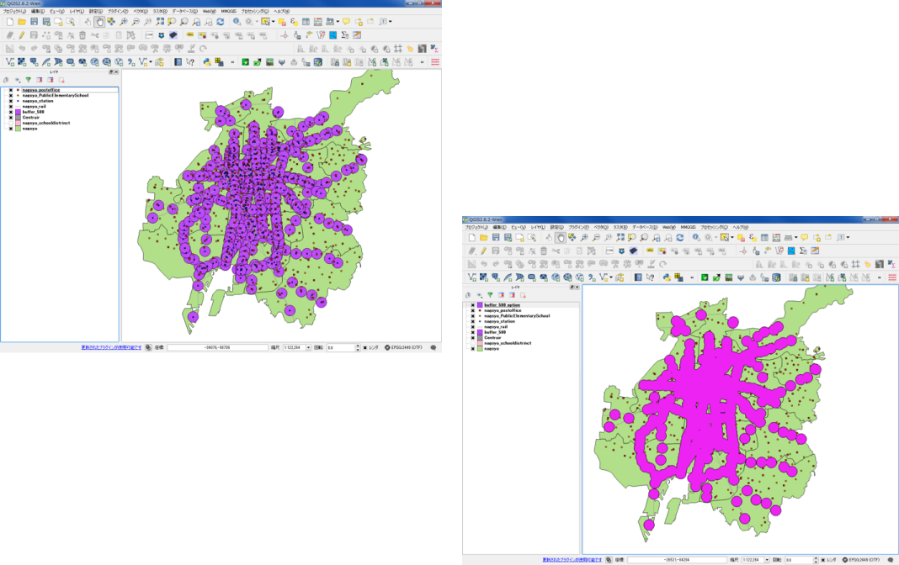  
(左)駅から500mのエリアが表示できた。  
(右)バッファの結果を融合にチェックをいれた場合。

### 空間検索を利用した抽出
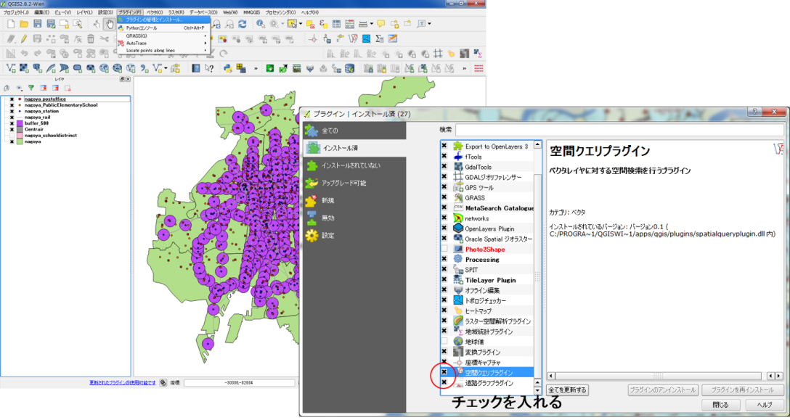  
プラグイン＞プラグインの管理とインストール

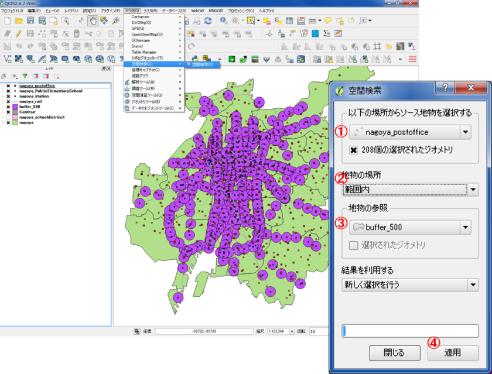  
ベクタ＞空間検索（S）＞空間検索（S）
① ソース地物の選択、郵便局を選択する。  
② 範囲内を選択する。  
③ buffer500mを選択する。  
④ 適用をクリックする。  

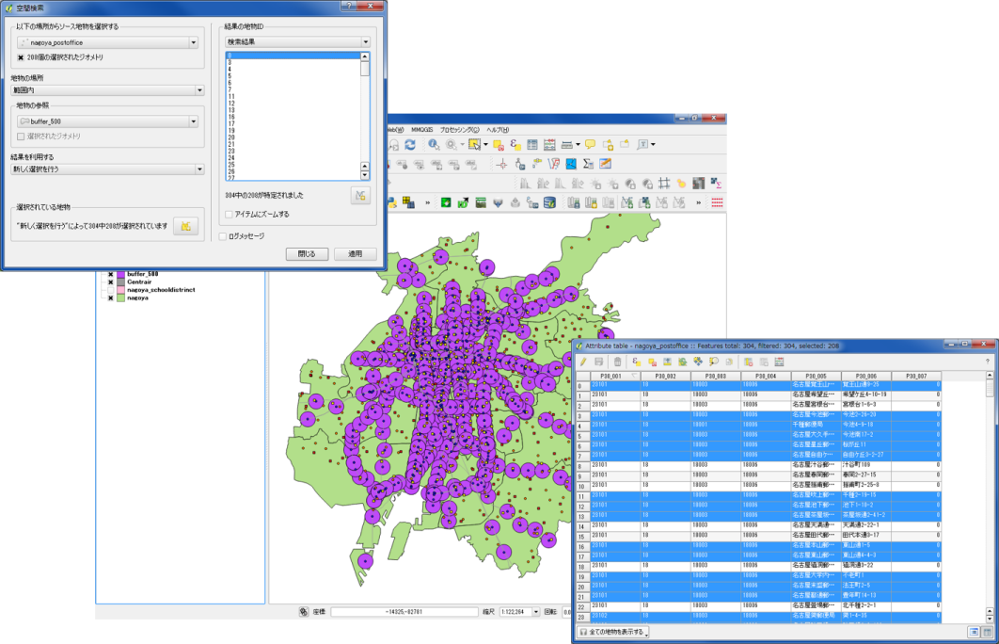  
駅から500m圏内の郵便局が選択された。  
選択した郵便局のみ保存することも可能。

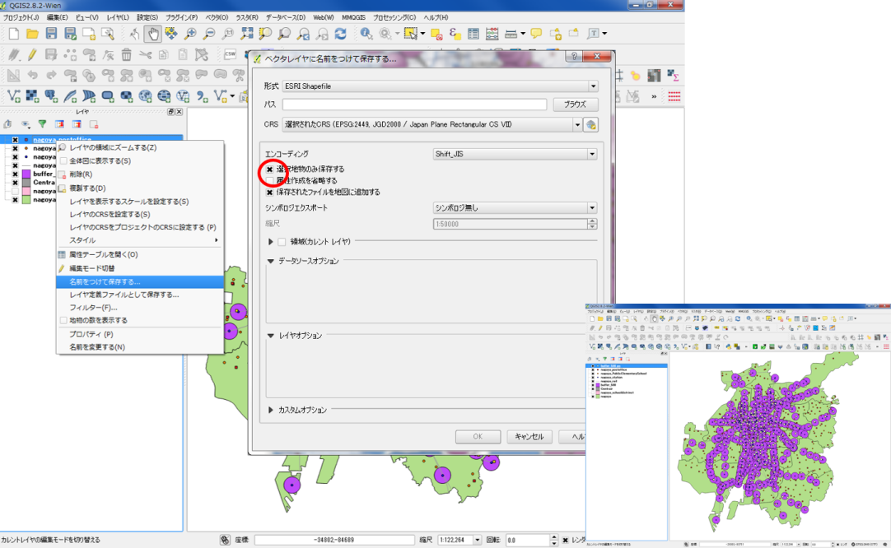  
レイヤの上で右クリックし、「名前をつけて保存する」から「選択地物のみ保存する」にチェックを入れて保存する。

### 多重リングバッファ
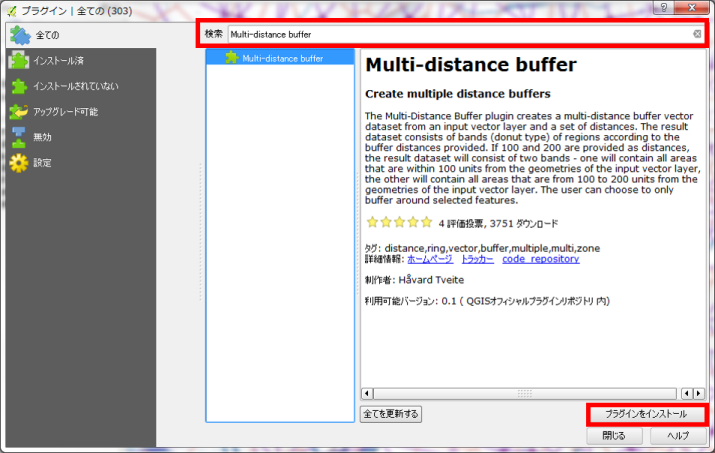  
プラグイン＞プラグインの管理とインストール
Multi-distance bufferを検索する。  
「プラグインをインストール」をクリックする。

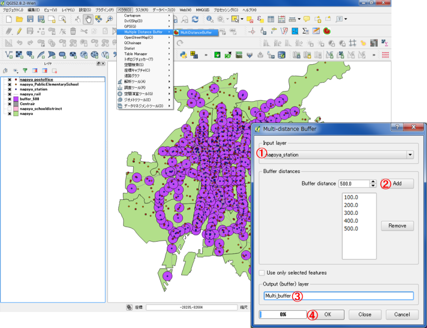  
ベクタ＞Multi-distance buffer＞Multi-distance buffer
① 駅を選択する。  
② Addで距離を追加する。  
③ 出力レイヤ名を入力する。  
④ OKをクリックする。  

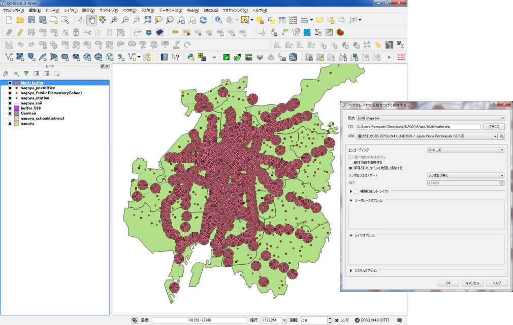  
１００ｍごとの多重リングバッファができた。  
「名前をつけて保存」から新規レイヤとして出力する。

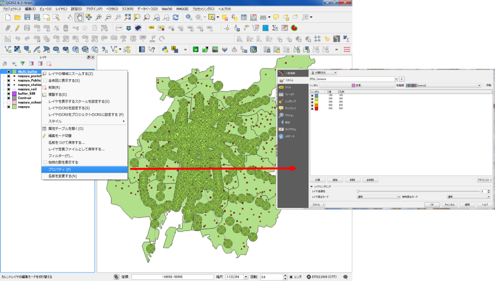  
属性データを用いて、100mごとの色分けを行う。

  
100mごとの多重リングバッファがみやすくなった。

### 線バッファと面バッファ
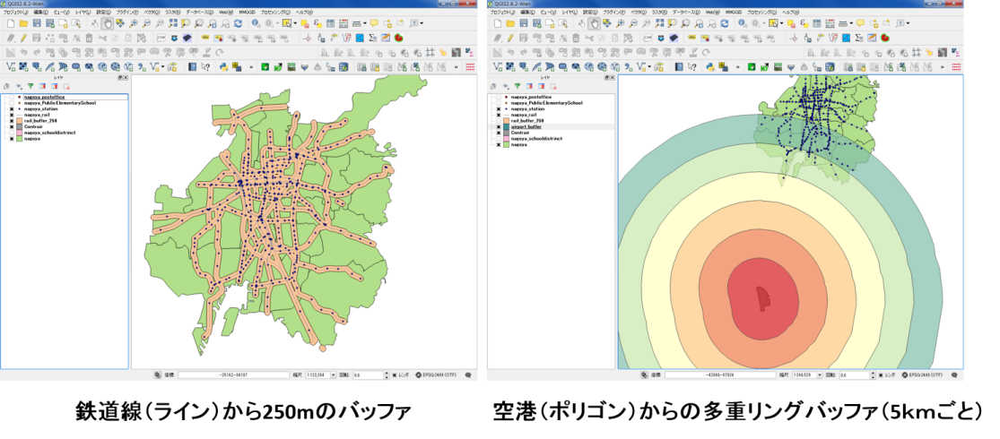  
同じ方法で、ラインやポリゴンからのバッファが作成できる。

[▲メニューへもどる]  
[▲メニューへもどる]:領域分析.md#menu

## ボロノイ分割による領域分析
学校の領域をボロノイ分割する。
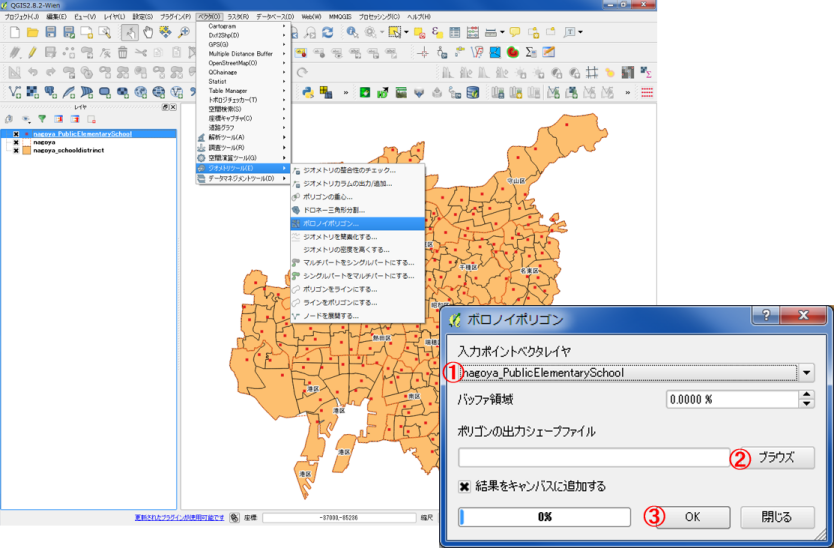  
ベクタ＞ジオメトリーツール＞ボロノイポリゴン
①公立小学校を選択する。  
②出力場所と名称を入力する。  
③OKをクリックする。  
※バッファ領域の値が大きいほど、ボロノイポリゴンの一番外側の領域が大きくなる。

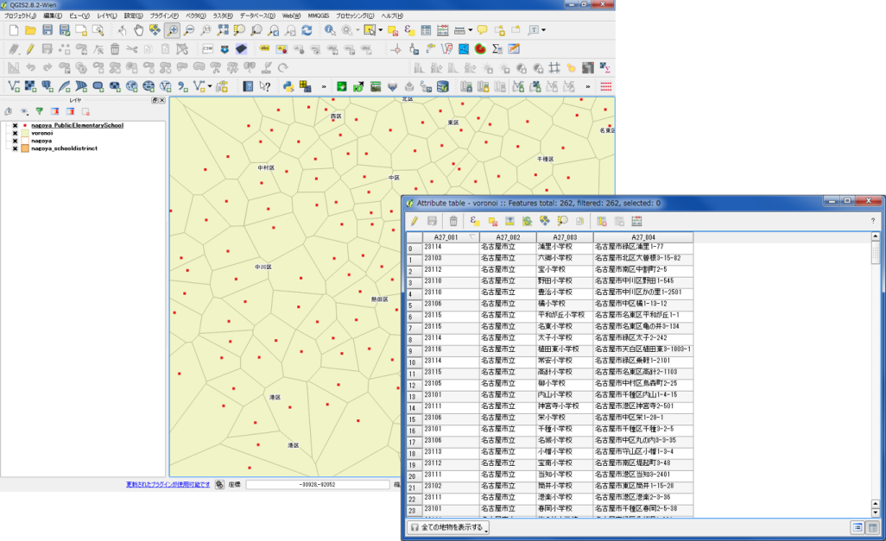  
ボロノイ領域に分割された。  
属性テーブルとして、ポイントの情報を保持する。

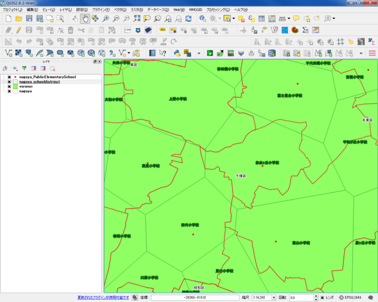  
スタイルを整えて、名古屋市の公立小学校区と勢圏（赤が小学校区、緑がボロノイポリゴン）を表示。

[▲メニューへもどる]  

## ドローネ三角形
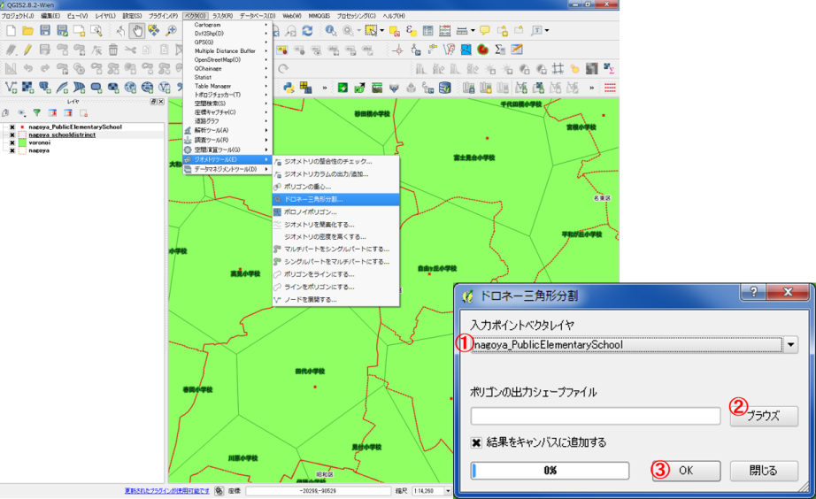  
ベクタ＞ジオメトリーツール＞ドローネ三角形分割
① 小学校を選択する。  
② 出力場所と名称を入力する。  
③ OKをクリックする。  

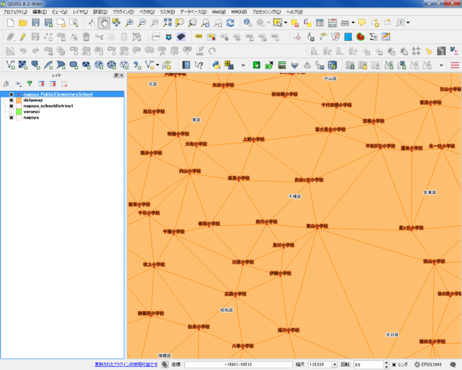  
ドローネ三角形による領域分割ができた。

[▲メニューへもどる]  

**その他のライセンス**  
本教材で利用しているキャプチャ画像の出典やクレジットについては、[その他のライセンスについて]よりご確認ください。
[その他のライセンスについて]:../その他のライセンスについて.md
