# 空間補間
　本教材は、「空間補間」の実習用教材です。GISソフトウェアを用いた、空間補間の手法について解説しています。ソフトウェアには、無償で利用できるQGIS、GRASS GIS、SAGA GISを用いています。  
講義用教材として、[地理情報科学教育用スライド（GIScスライド）]の4章が参考になります。  

本教材を使用する際は、[利用規約]をご確認いただき、これらの条件に同意された場合にのみご利用下さい。

[地理情報科学教育用スライド（GIScスライド）]:http://curricula.csis.u-tokyo.ac.jp/slide/4.html
[利用規約]:../../../master/利用規約.md

**Menu**
------
* [不整三角網](#不整三角網)
* [逆距離加重法](#逆距離加重法)
* [スプライン補間](#スプライン補間)
* [クリギング](#クリギング)

**使用データ**
* [国土数値情報] 平成27年東京都地価公示　を加工
* [国土数値情報] 東京都行政区画　を加工
* [国土数値情報] 東京都河川　を加工
* 基盤地図情報　東京都　標高点 を加工

[国土数値情報]:http://nlftp.mlit.go.jp/ksj/index.html

**スライド教材**  
スライドのダウンロードは[こちら](../../../../raw/master/GISオープン教材/18_空間補間/空間補間.pptx)

----------

## 不整三角網 
#### TIN:Triangulated lrregular Network
東京都の標高点を利用し、TINで補間を行う。  
補間されたラスタデータをもとに、等高線を作成する。  
QGISを使用する。

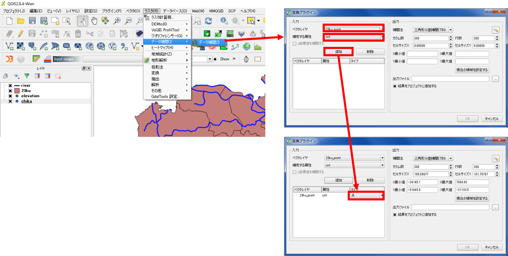
河川や標高点などのレイヤを読み込む。  

ラスタ＞データ補間＞データ補間をクリック。  
ベクタレイヤから標高点、補完する属性は、標高データの列を選択し、追加をクリックし、タイプを点に変更する。

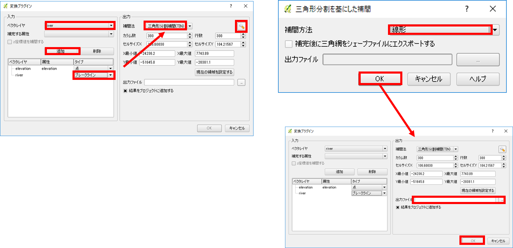
ベクタレイヤで河川を選択し、追加をクリックする。  
タイプをブレークラインに設定する。  
補完法を三角形分割補間（ＴＩＮ）とし、設定ボタンから、補間方法を線形に設定し、ＯＫをクリックする。  

出力ファイル先とファイル名を指定し、ＯＫをクリックする。  

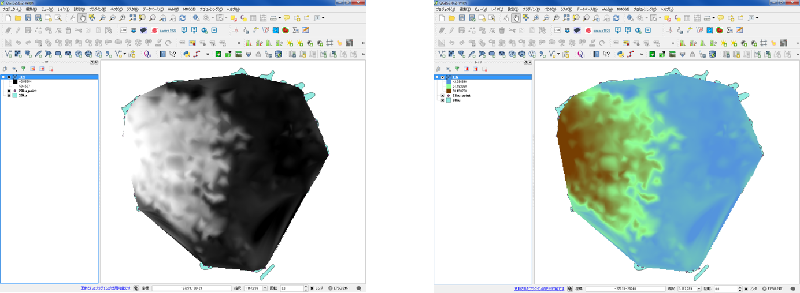
左の図のように出力されるので、レイヤのプロパティから標高値に応じてスタイルを整える。  

空間補間したデータのセル値を利用して等高線が抽出できる。  
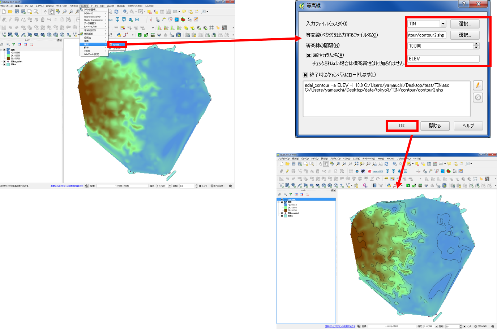
ラスタ＞抽出＞等高線　を選択する。  
入力ファイル、出力先、等高線の間隔を指定する。  
属性カラムにチェックを入れ、ＯＫをクリックすると等高線が表示される。  

[▲メニューへもどる]  
[▲メニューへもどる]:空間補間.md#menu

## 逆距離加重法 
#### IDW:Inverse Distance Weighted
東京都の地価データを利用し、IDWで補間を行う。  
QGISを使用する。

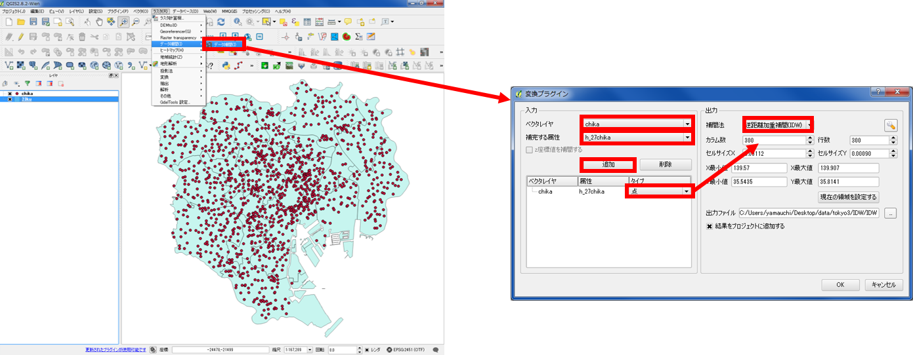
ラスタ＞データ補間＞データ補間をクリック。  
ベクタレイヤを東京都の地価公示にする。  
補完する属性を地価データとする（属性テーブルから地価データを数値型に変換しておく）。  
タイプから点を選択し、補完法を逆距離加重法（IDW）とする。  
出力ファイル先とファイル名を選択し、OKをクリックする。  

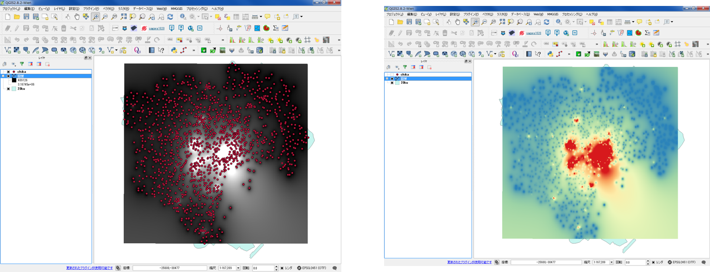
左の図のように出力されるので、レイヤのプロパティから配色を整える。

[▲メニューへもどる]  

## spline補間 
東京都の地価データを利用し、splineで補間を行う。  
GRASS GISを使用する。

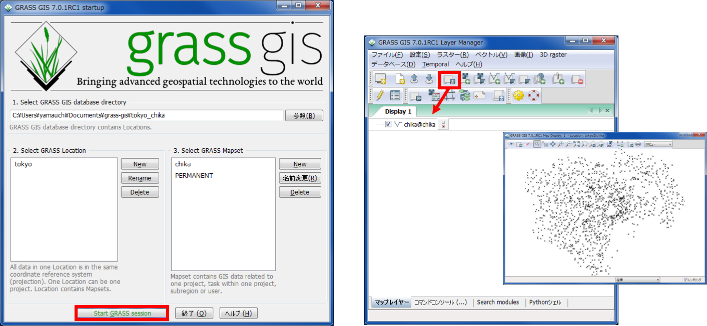
QGISからGrassデータセットを作成し、GRASSを起動する。  
GRASSでshapeファイルを読み込む。  

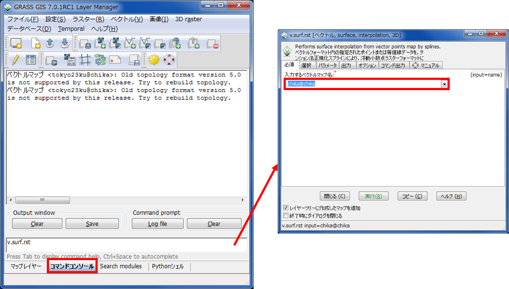
コマンドコンソールからv.surf.rstを入力し、Enter キーを押す。  
入力するベクトルマップ名（地価データ）を選択する。

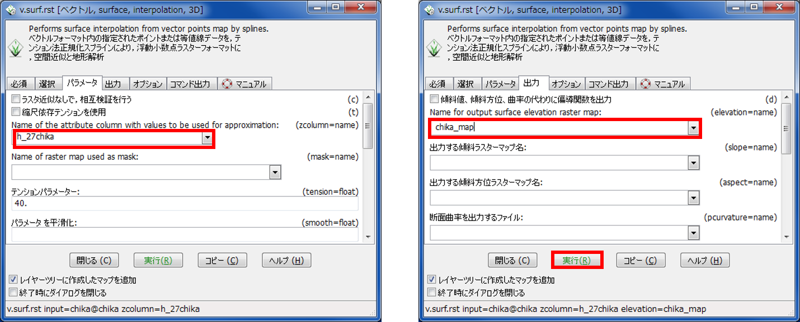
パラメーターで地価データの列を選択し、出力から出力データの名称を入力し、実行をクリックする。

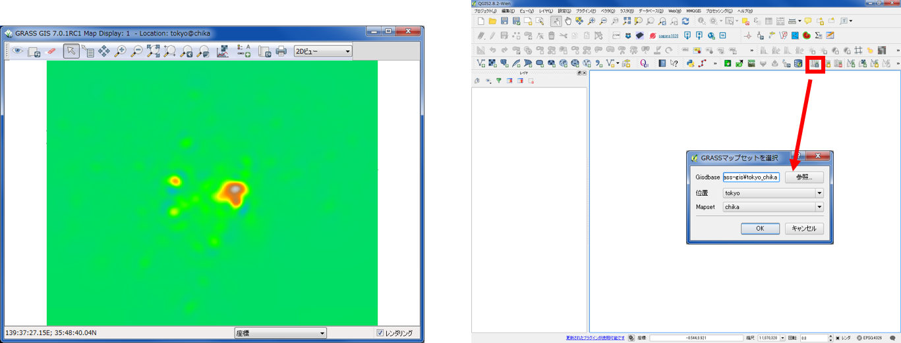
左の図のように出力されるので、QGISで読み込み、レイヤのプロパティから配色を整える。  
先ほどのマップセットをＱＧＩＳから読み込む。

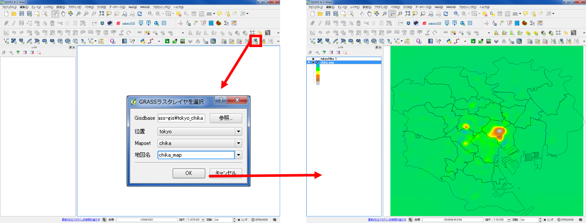
先ほど作成したラスタデータを読み込む。

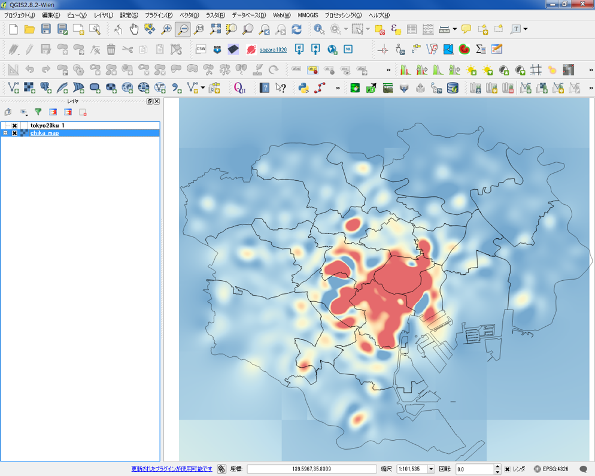
値に応じて配色を整え、QGISで表示する。

## クリギング
東京都の地価データを利用し、クリギングで補間を行う。  
SAGA GISを使用する。

SAGA GISを利用し、通常クリギングを実行する。
[SAGA GISのダウンロードサイト](https://sourceforge.net/projects/saga-gis/files/)から、ソフトウェアをダウンロードする。

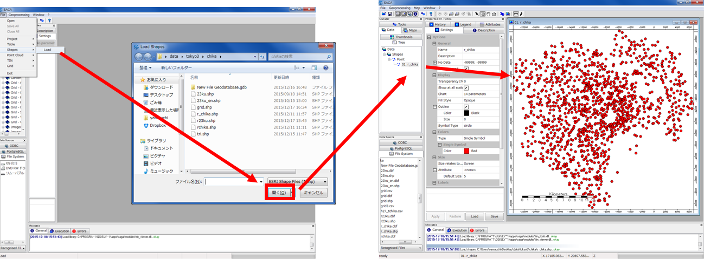
SAGA GISを起動し、File > Shapes > Load からポイントデータ（地価データ）を読み込む。  
ManagerからTreeタブをクリックし、入力したデータをダブルクリックするとデータが表示される。  

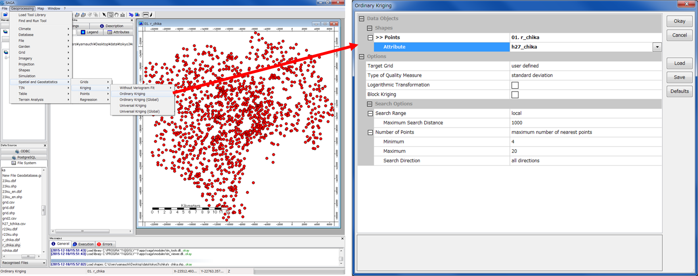
Geoprocessing > Spatial Geostatistics > Ordinary Kriging をクリックする。  
pointsで地価データを選択し、Attributeで地価の列を選択し、ＯＫをクリックする。  
※今回は、パラメーターをデフォルトとした。

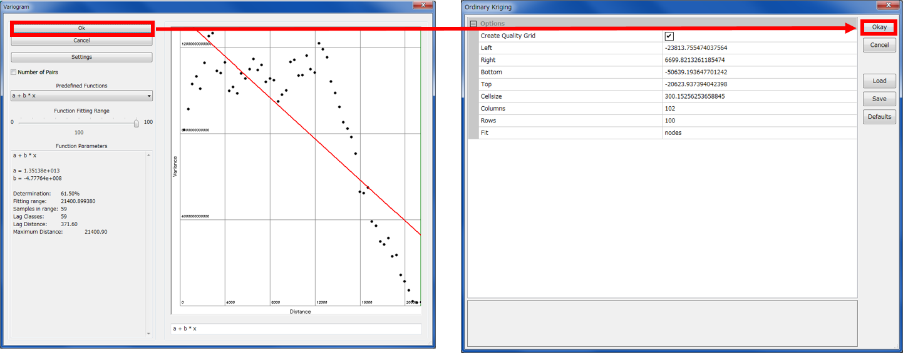
バリオグラムが表示されるので「OK」をクリックし、次のウインドウも「Okay」をクリックする。

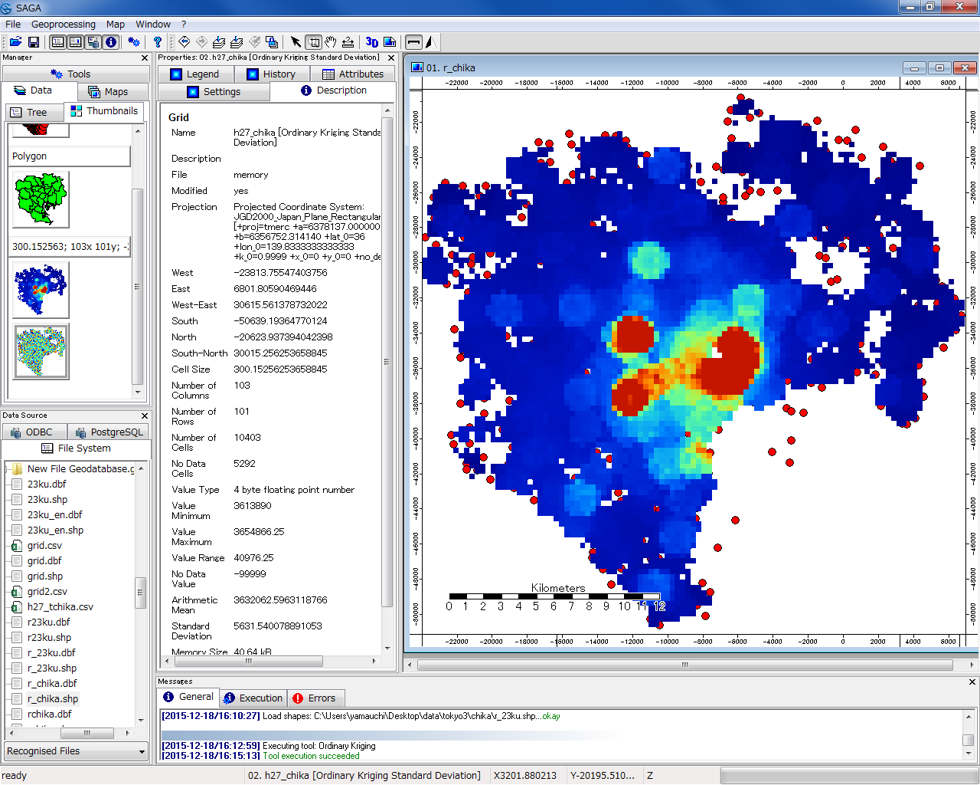
クリギングされたデータが表示できた。

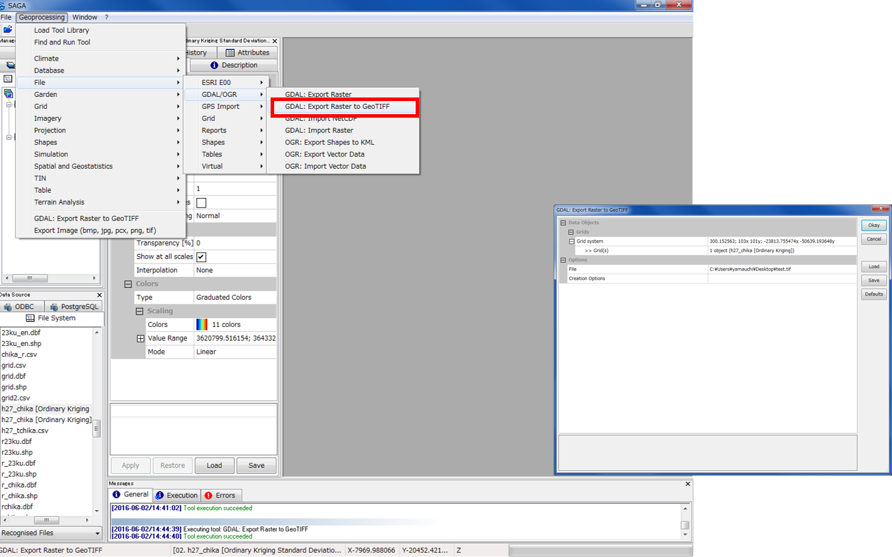
データをGeotiffでエクスポートすることも可能。

[▲メニューへもどる]  

**その他のライセンス**  
本教材で利用しているキャプチャ画像の出典やクレジットについては、[その他のライセンスについて]よりご確認ください。
[その他のライセンスについて]:../その他のライセンスについて.md
