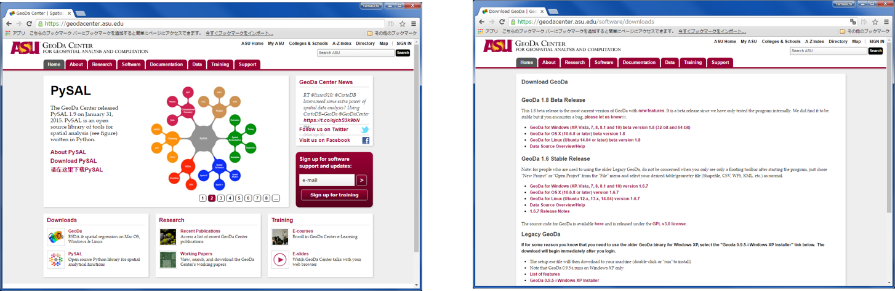
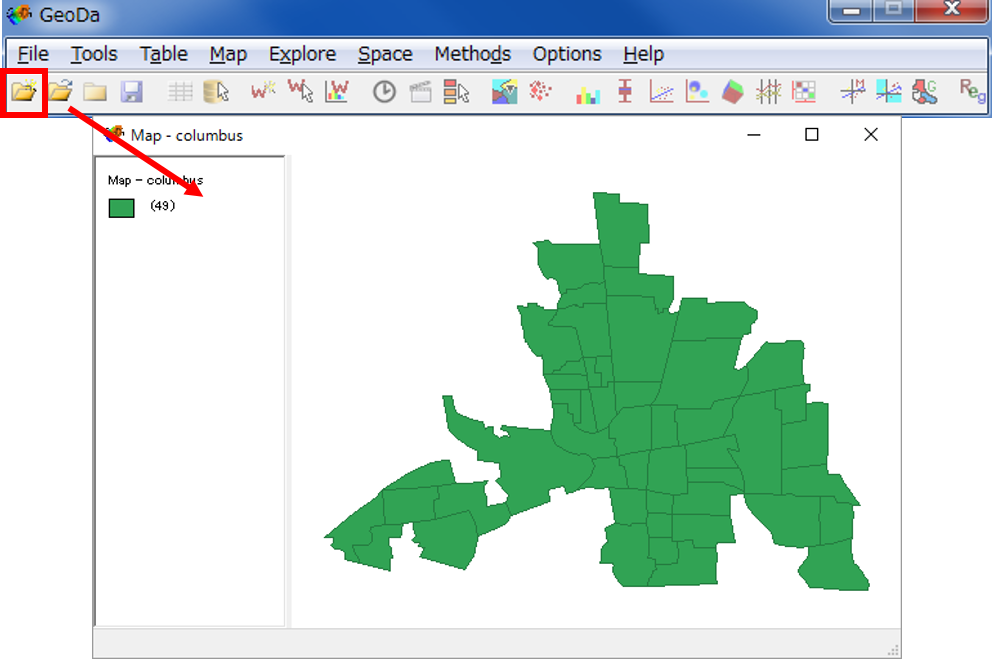
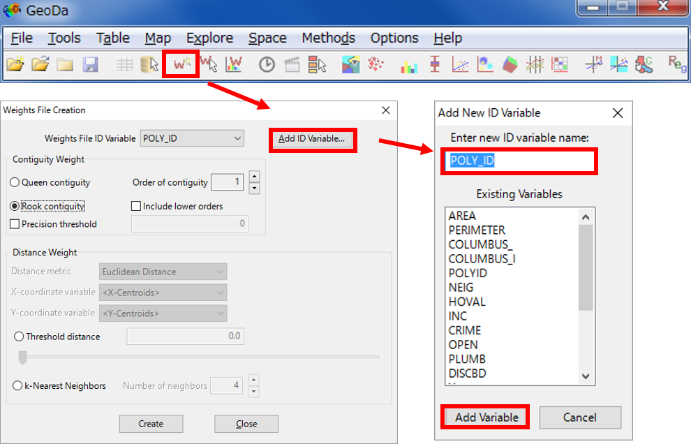
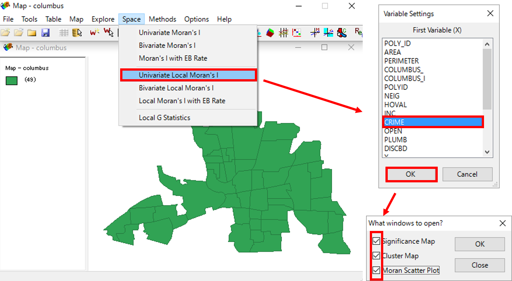
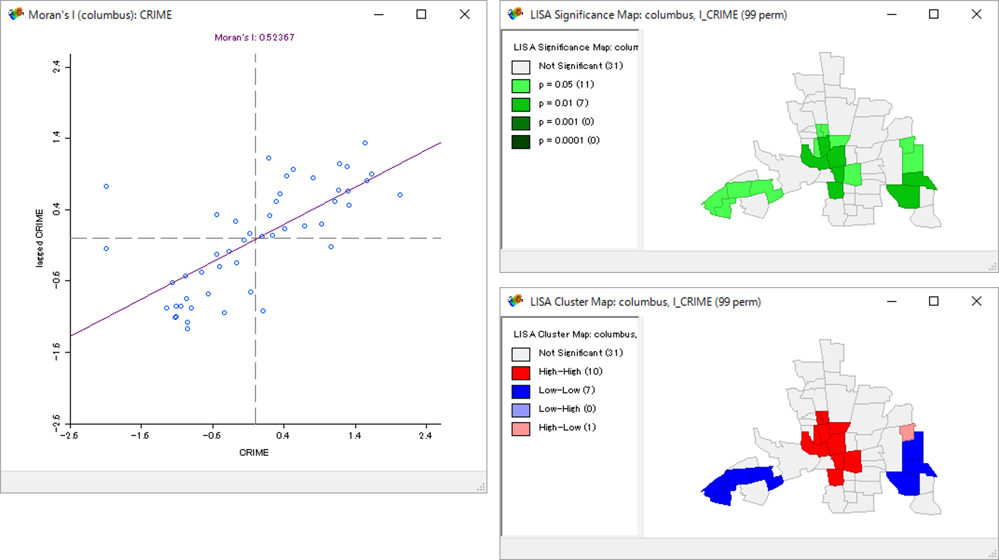

# 空間分析におけるスケール

本教材は、「ラスタデータの分析」の実習用教材です。GISソフトウェアを用いた、ラスタデータの分析の手法について解説しています。ソフトウェアには、無償で利用できるQGISとGRASSを用いています。  
講義用教材として、[地理情報科学教育用スライド（GIScスライド）]の4章が参考になります。  

本教材を使用する際は、[利用規約]をご確認いただき、これらの条件に同意された場合にのみご利用下さい。

[地理情報科学教育用スライド（GIScスライド）]:http://curricula.csis.u-tokyo.ac.jp/slide/4.html
[利用規約]:../../../master/利用規約.md

**Menu**
------
* [GeoDaのインストール](#GeoDaのインストール)
* [local moran’s I の算出](#local moran’s I の算出)

**使用データ**
* GeoDa sample data 「clumbs.shp」を利用　シカゴ大学  
（https://spatial.uchicago.edu/sample-data）

**スライド教材**  
スライドのダウンロードは[こちら]
[こちら]:../../../../raw/master/GISオープン教材/20_空間分析におけるスケール/空間分析におけるスケール.pptx

----------

## GeoDaのインストール

[GeoDaのダウンロードサイト](https://geodacenter.asu.edu/) にアクセスして、GeoDaをインストールする。

### GeoDaの起動とデータの読み込み
  
GeoDaを起動し、File>New project From>Shape fileを選択し、（もしくは、赤枠アイコンをクリックする）columbs.shp を読み込む。  

[▲メニューへもどる]:(空間分析におけるスケール.md#Menu)  

## local moran’s I の算出

Local Moran’s I を計算するために、重み付けファイルを作成する。
Tool > Weight > Create を選択する（もしくは赤枠のアイコンを選択する）。
新規に　weights File ID Variable　を作成し、任意の項目を選択し、createをクリックする（.galもしくは.gwtファイルを使用するshapeファイルと同じ場所に保存する）。

Space>Univate Local Morans’s I を選択し、CRIME を選択する(1000世帯あたりの住居侵入窃盗と車両盗難のLocal Morans I を算出する)。  
出力する散布図や地図を選択し、「OK」をクリックする。  

1000世帯あたりの住居侵入窃盗と車両盗難のLocal Moran’s I が算出できた。

[▲メニューへもどる]

**その他のライセンス**  
本教材で利用しているキャプチャ画像の出典やクレジットについては、[その他のライセンスについて]よりご確認ください。
[その他のライセンスについて]:../その他のライセンスについて.md
