# 視覚的伝達
本教材は、「視覚的伝達」の実習用教材です。GISソフトウェアを用いた、地理空間情報の視覚化手法について解説しています。ソフトウェアには、無償で利用できるQGISとGeoDaを用いています。講義用教材として、[地理情報科学教育用スライド（GIScスライド）]の5章が参考になります。  

本教材を使用する際は、[利用規約]をご確認いただき、これらの条件に同意された場合にのみご利用下さい。

[地理情報科学教育用スライド（GIScスライド）]:http://curricula.csis.u-tokyo.ac.jp/slide/5.html
[利用規約]:../../../master/利用規約.md

**Menu**
------
* [属性データの視覚化](#属性データの視覚化)
* [カルトグラムの作成](#カルトグラムの作成)

**使用データ**
* 政府統計の総合窓口([e-Stat])東大阪市行政界shapeファイル

[e-Stat]:http://www.e-stat.go.jp

**スライド教材**  
スライドのダウンロードは[こちら]
[こちら](../../../../raw/master/GISオープン教材/21_視覚的伝達/視覚的伝達.pptx)

----------

## 属性データの視覚化
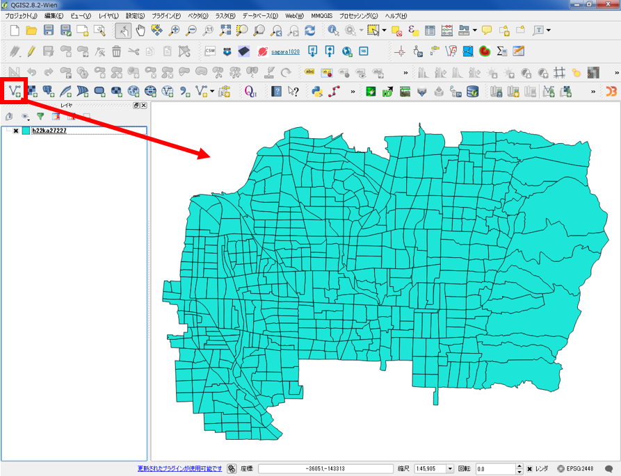
東大阪市の行政界データをQGISでインポートする。

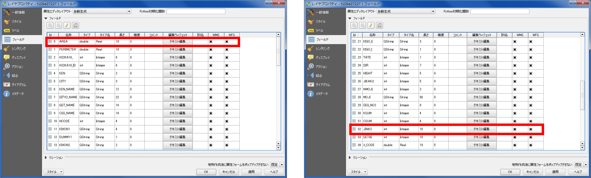
レイヤのプロパティを開きデータのタイプを確認する。  
※ タイプがStringだと、計算ができない。

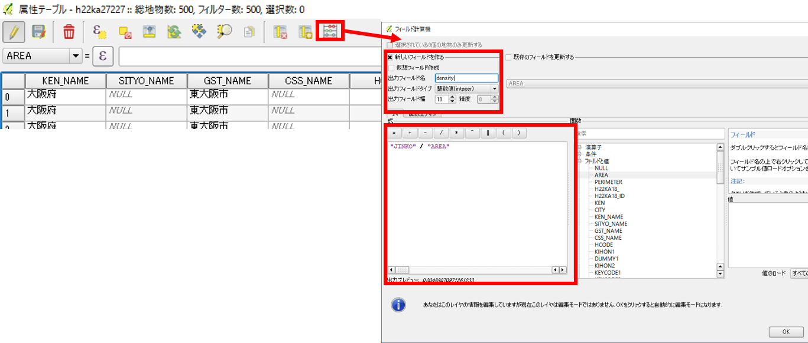
レイヤから属性テーブルを開き、フィールド計算機をクリックする。  
新しいフィールドを作るにチェックを入れ、出力フィールド名を入力する。  
出力フィールドタイプをrealにし、フィールドの幅と精度を入力する。  
関数のフィールドと値から、”JINKO”と”AREA”をダブルクリックする。  
人口/面積で人口密度を計算する（単位は、㎡）。  

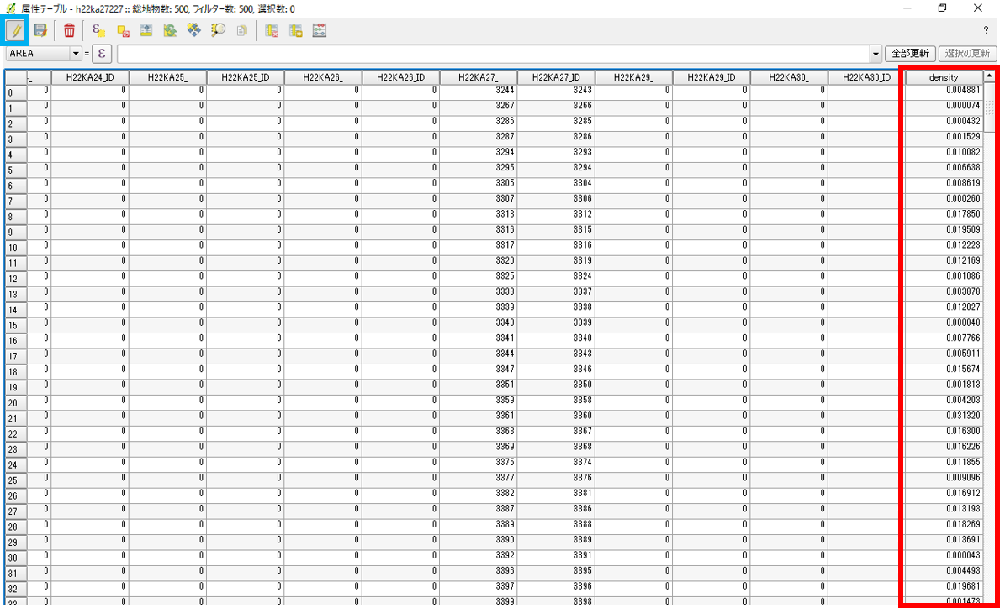
新しいフィールドに、1㎡あたりの人口密度が計算された。  
編集マークをクリックし、計算を保存し属性テーブルを閉じる。  

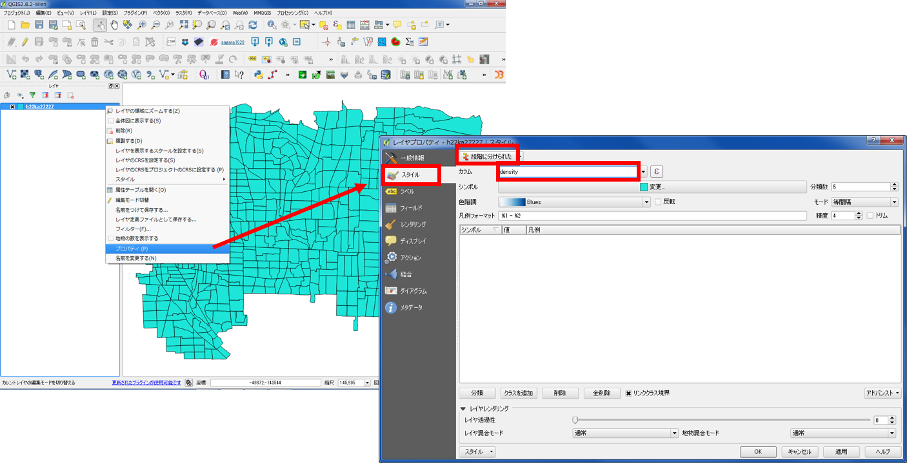
プロパティからスタイルを選択し、「段階に分けられた」に切り替える。  
カラムから、densityを選択する（属性テーブルの列名が表示される）。  

### 等間隔分類
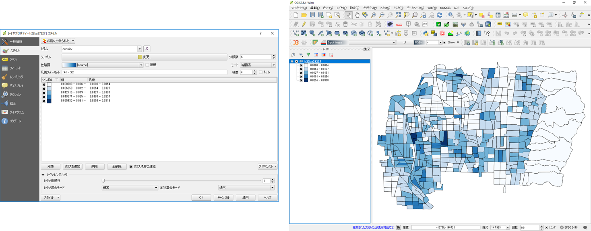
等間隔分類・・・最大最小値を除し、属性値の範囲が等間隔になるように階級区分を割り当てる。  

### 等量分類
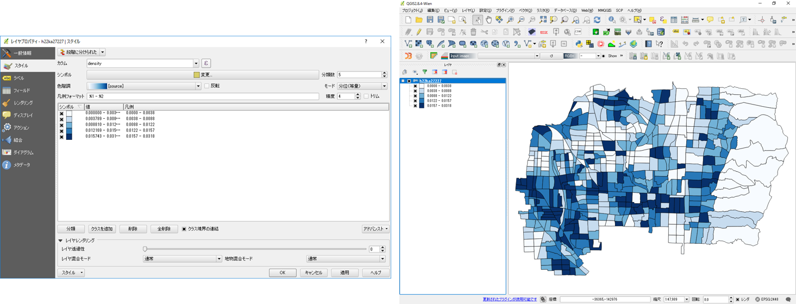
等量分類・・・階級数のデータ数が、等しくなるように階級区分が割り当てられる。  

### 自然分類（自然なブレーク）
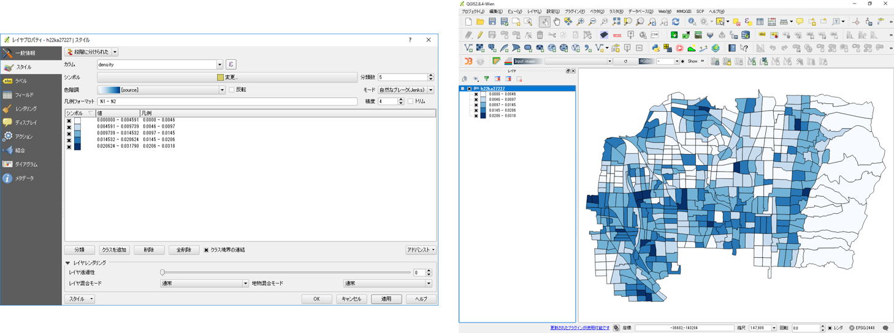
自然分類・・・頻度分布などにより、グループを形成させ、データの変化量が大きい箇所に各グループの階級区分を割り当てる。  

### 標準偏差分類
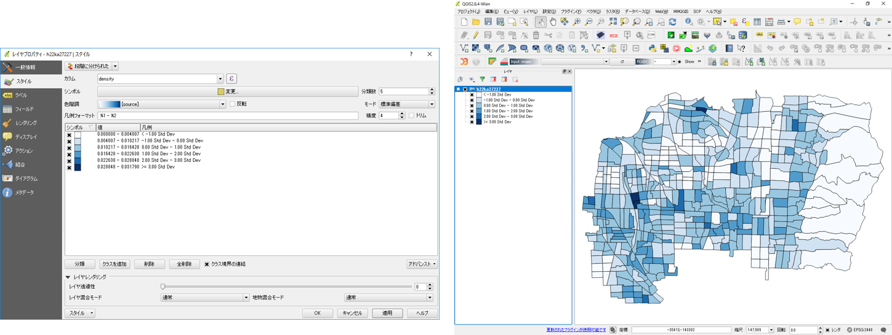
標準偏差分類・・・平均値から標準偏差を加減した値により、階級区分を割り当てる。  

[▲メニューへもどる]:視覚的伝達.md#menu

## カルトグラムの作成 
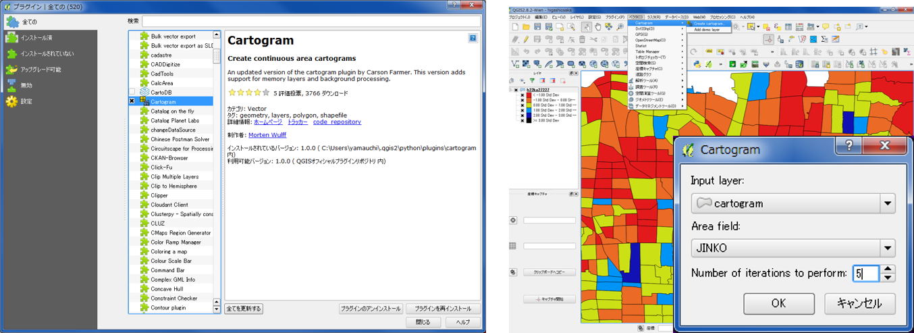
プラグインの管理とインストールから、Cartogramプラグインをインストールする。  
ベクタ＞Cartogram＞Create Cartogram　人口のテーブルを選択し、カルトグラムを作成する。  
※　対象とする属性テーブルから０を含むものを削除する（０があると表示されない） 。  

東大阪市の町丁目ごとの人口をもとにしたカルトグラムが作成できた。

### GeoDaを用いたCartogramの作成
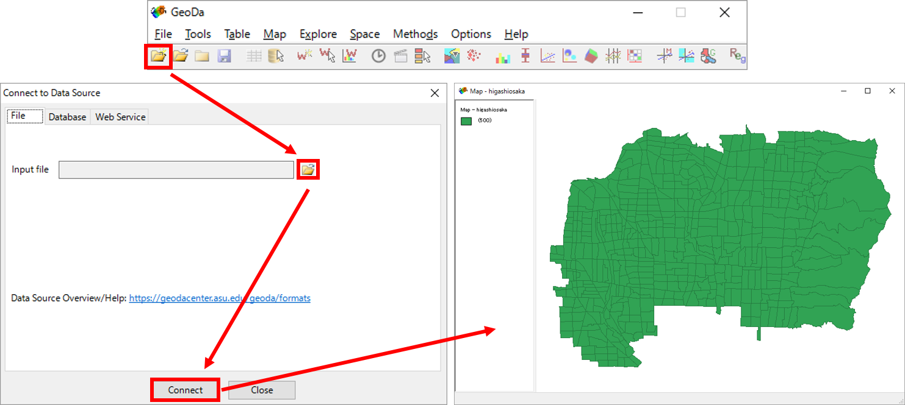
GeoDaを起動し、New project アイコンをクリックし、ファイル形式とデータを選択し「Connect」する。

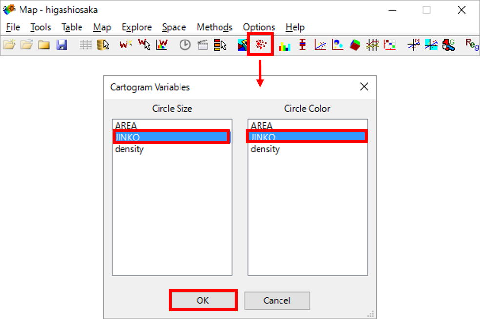
Cartogramのアイコンをクリックし、Circle Sizeのデータを選択し「OK」をクリックする。  
※　Circle color はデフォルトでも表示される

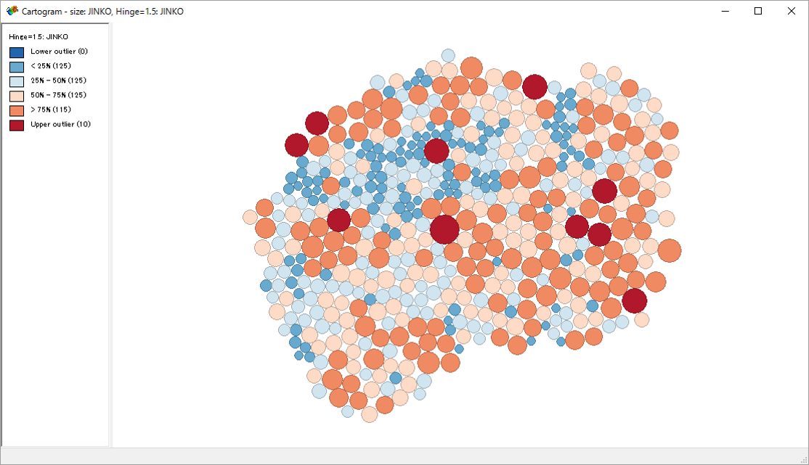
東大阪市の町丁目ごとの人口を円の大きさで示したカルトグラムが作成できた。

[▲メニューへもどる]:視覚的伝達.md#menu

**その他のライセンス**  
本教材で利用しているキャプチャ画像の出典やクレジットについては、[その他のライセンスについて]よりご確認ください。
[その他のライセンスについて]:../その他のライセンスについて.md
