# Cesiumによるデータの可視化

本教材は、Cesiumを用いて空間データを表示する手法について解説しています。Cesiumの機能の呼び出しやKMLデータの表示などを行います。Cesiumの表示には、GitHubを用いてインターネットで公開される状態で行います。CZMLについての解説は、[CZML入門]の教材を参照ください。
本教材を使用する際は、[利用規約]をご確認いただき、これらの条件に同意された場合にのみご利用下さい。

[利用規約]:../../../../master/利用規約.md
[CZML入門]:../../インターネットの活用に関する教材/czml入門/czml入門.md
**Menu**
------
* [Cesiumとは](#Cesiumとは)
* [Cesiumを体験する](#Cesiumを体験する)
* [ダウンロード](#ダウンロード)
* [レイヤを追加する](#レイヤを追加する)
* [視点を変更する](#視点を変更する)
* [kmlの作成と読み込み](#kmlの作成と読み込み)

**使用データ**

* [越前市オープンデータ] 越前市防災安全課　一次避難場所（風水害）、浸水想定区域（風水害）のデータを加工し、利用。


[越前市オープンデータ]:http://www.city.echizen.lg.jp/office/010/021/open-data-echizen.html

**スライド教材**  
スライドのダウンロードは[こちら]
[こちら]:../../../../../raw/master/GISオープン教材/インターネットの活用に関する教材/Cesiumによるデータの可視化/Cesiumによるデータの可視化.pptx
--------

## Cesiumとは
- CesiumはWeb GL を用いたライブラリ
- 2Dだけでなく、3D表示ができる
- 球体のため、世界規模のデータの表示に適している
- 時系列データの表示も可能  
[▲メニューへもどる]  
[▲メニューへもどる]:Cesiumによるデータの可視化.md#menu

## Cesiumを体験する
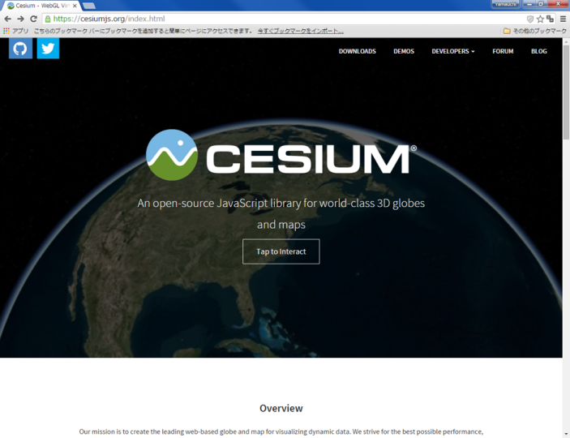  
[Cesiumの公式サイト]をブラウザで開く。  
ページ下段のGet HelloWorld.jsの[PLAY WITH THIS CODE]クリックし、Cesium画面を表示する。

  

[Cesiumの公式サイト]:http://cesiumjs.org
[PLAY WITH THIS CODE]:http://cesiumjs.org/Cesium/Apps/Sandcastle/index.html?src=Hello%20World.html&label=All

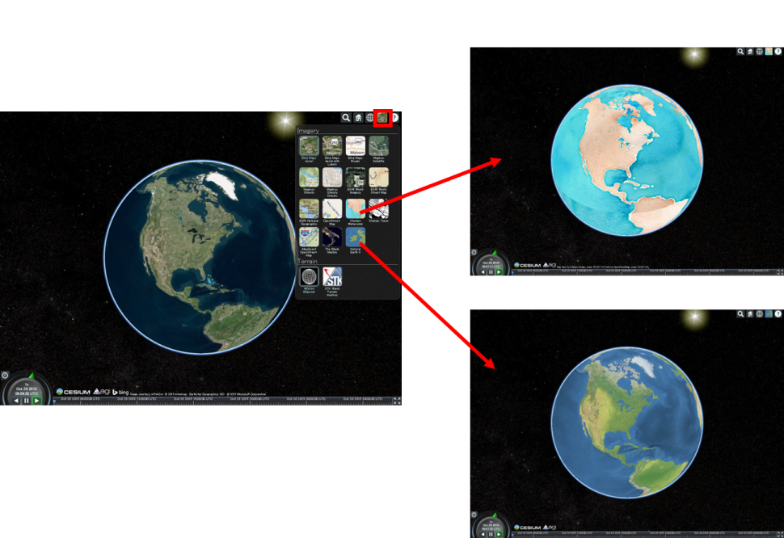  
右上のボタンから、複数BaseMapを選択することができる。

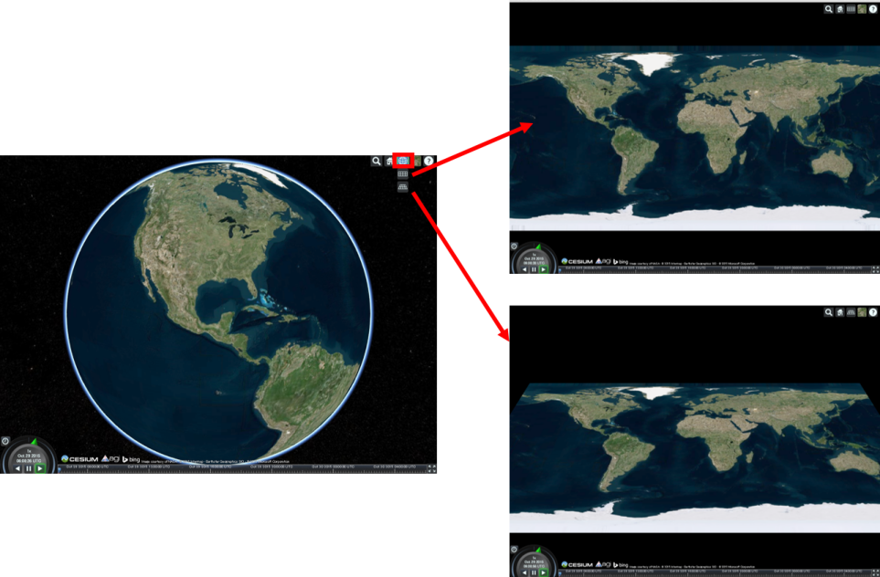  
右上のボタンから、球体、平面、角度つき平面の３つで地球を表現できる。

[▲メニューへもどる]  

## Cesiumのダウンロード
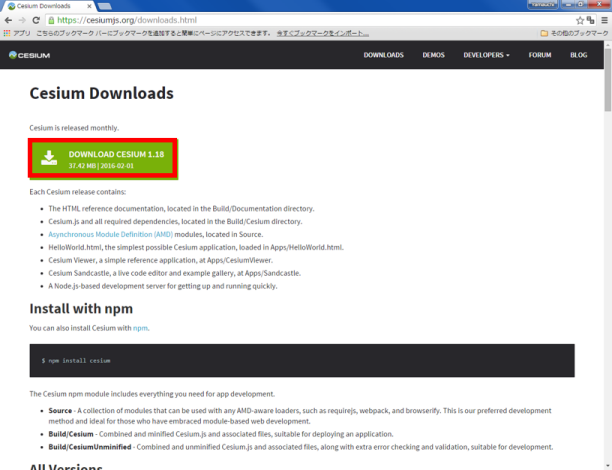  
Cesiumのホームページの[Downloads]から、ダウンロードすることができる。
[Downloads]:https://cesiumjs.org/downloads.html

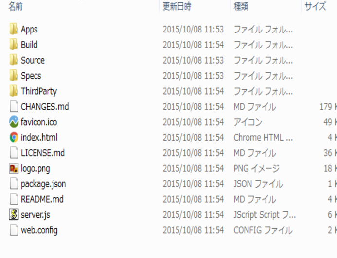  
Git Hubでリポジトリを作成して、ローカルからPushすることでcesiumをwebにアップロードできる
※デモデータなどが入っているため重たいため、本教材では使用しない。

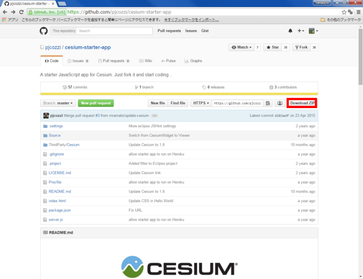  
https://github.com/pjcozzi/cesium-starter-app にアクセスし、「Download ZIP」 をクリックする。
pjcozzi氏がCesiumを編集しやすい形にしたものを公開しているためそれを利用する。

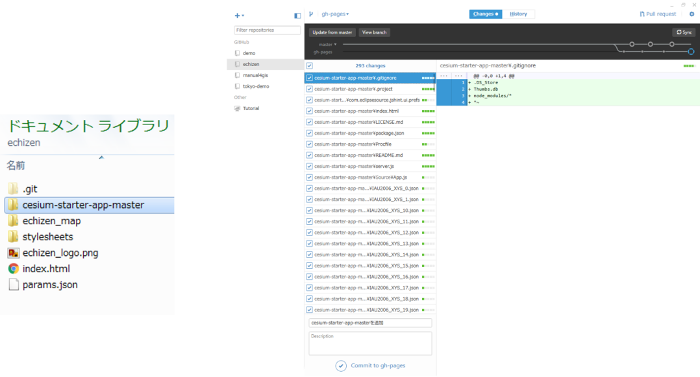  
解凍した「cesium-starter-app」をクリックし、ローカルリポジトリへ移動する。
クライアントソフトを更新しておく。

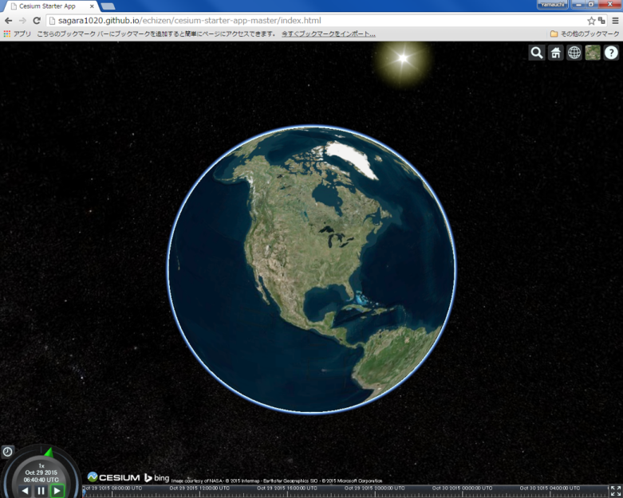  

```
http://（ユーザー名）.github.io/echizen/cesium-starter-app-master/index.html
```

gh-pagesを開き、Cesiumの起動を確認する。　※ローカルでcesiumは起動しない

[▲メニューへもどる]  

## レイヤを追加する
### ポイントを追加する
（以下、クライアントソフトのsyncを行う点は省略する）
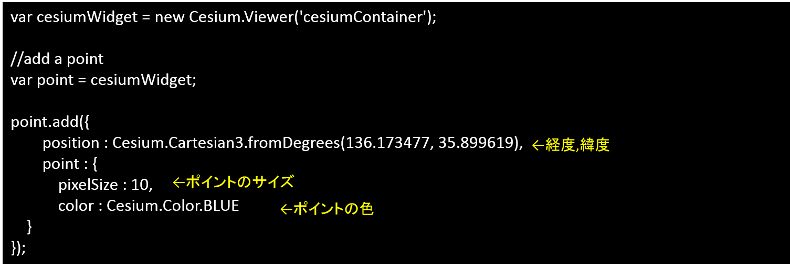  
ポイントを追加する：point とへいう変数を設定し、色や位置を設定する。

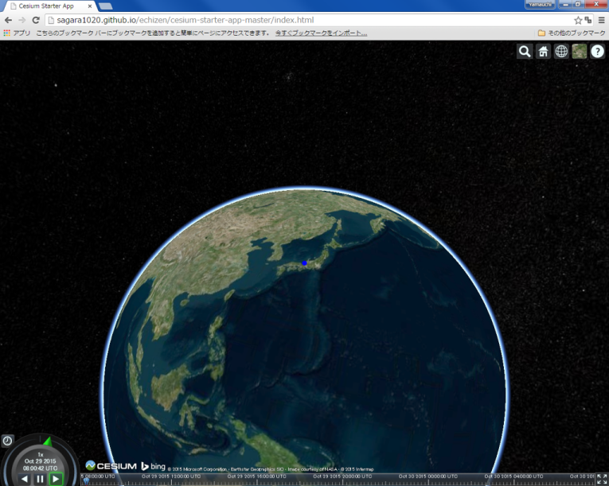  
青い円形のポイントが、越前市周辺に追加された。

### ラインを追加する
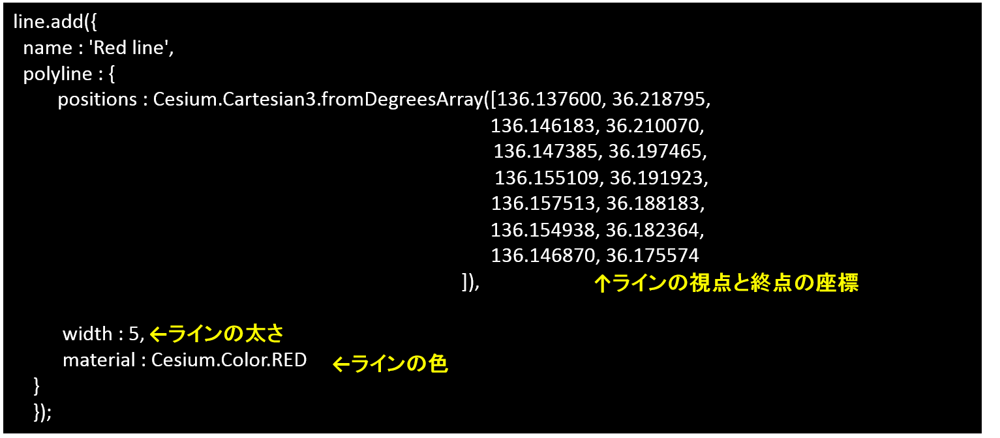  

  
九頭竜川に沿って、赤いラインが作成できた。

### ポリゴンを追加する
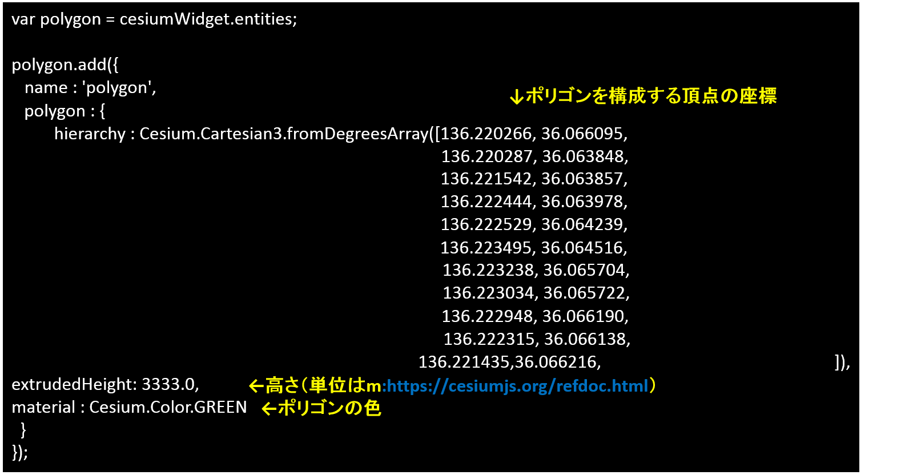  

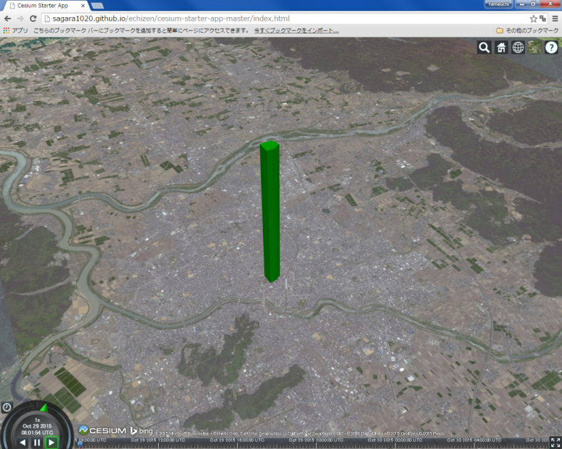  
高さを保持した緑色のポリゴンが表示できた。

[▲メニューへもどる]  


## 視点を変更する

```
cesiumWidget.camera.flyTo({   
     destination : Cesium.Cartesian3.fromDegrees(136.194763, 36.047711, 45000.0)});
```
ビューワーの視点を変更するコードを追加（経度、緯度、視点の高さを入力する）し、再読み込みを行うと視点が変更される。

[▲メニューへもどる]  


## kmlの作成と読み込み
### GoogleEarthでkmlを作成→Cesiumで読み込み
①　GoogleEarth proでshapeファイルを読み込む。  
ファイル＞開く　（想定浸水区域と一次避難所のshape）  

②　取得したアイテムにスタイルテンプレートを適用（スタイルを調整）。  
名前を指定する：「名前フィールド」を設定する。  
色を指定する：「フィールドから色を設定する」を選択する。  
設定ができたらOKをクリックし、テンプレートを保存する。  

③　レイヤの上で右クリックし、プロパティから、ポリゴンの透過度を変更する。想定浸水区域のポリゴンと同じく、名前、色、アイコン、高さなどを設定する。  

④　レイヤの上で右クリックし、追加→フォルダを選択し、フォルダ名を入力する。  
フォルダーを移動して、フォルダの中にポリゴンとポイントのデータをまとめる。  


### KML読み込み
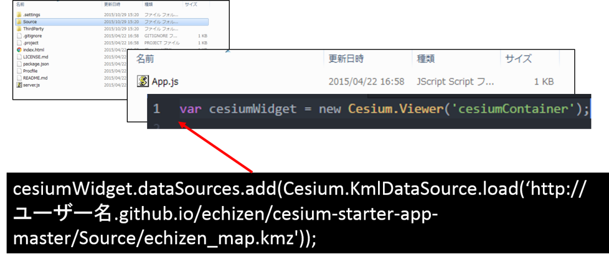  
Sourceファイルの中のApp.jsをテキストエディタで開く。
var cesiumWidget = new Cesium.Viewer('cesiumContainer');
の下にkmlを読み込むコードを入力する。

  
クライアントソフトを通してアップロードし、Webで確認すると↑のように表示される。
ポイントをクリックすると、kmlの属性データが反映されていない。

### KMLの書き換え
  
ポイントレイヤの上で右クリックし、名前をつけて場所を保存から新規にkmlを保存する。

  
<BalloonStyle></BalloonStyle>を削除する（2箇所）。

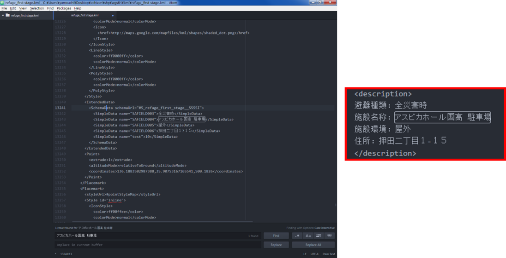  
<description></description>を右のように書き換える。

⑤　GoogleEarthからポイントレイヤの上で右クリックし、名前をつけて場所を保存から新規にkmlを保存する。  

⑥　テキストエディタを開き、kmlを書き換える。  

⑦　kmlをもう一度読み込み、表示を確認する。プロパティを開きその他の情報を追加する。  

⑧　バルーンの設定:リンクを追加をクリックしURLを追加する（越前市の防災課）。  
アイコンの設定：ラベルの縮尺を0.0にする。  

⑨　凡例画像を作成し、GitHubにアップロードし、GoogleEarthでレイヤのプロパティから、画像を追加する。  
アップロードしたURLを指定すると、cesiumで画像を表示できる。  


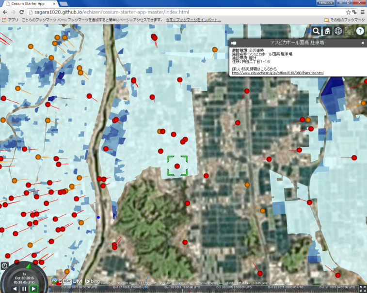  
Cesiumで表示すると、ポイントの情報が表示できる。

使用した凡例の画像は[ここをクリック]。
[ここをクリック]:pic/cesiumpic_hanrei.png

  
ポイントをクリックすると凡例も表示できるようになった。

[▲メニューへもどる]

**その他のライセンス**  
本教材で利用しているキャプチャ画像の出典やクレジットについては、[その他のライセンスについて]よりご確認ください。
[その他のライセンスについて]:../../その他のライセンスについて.md
